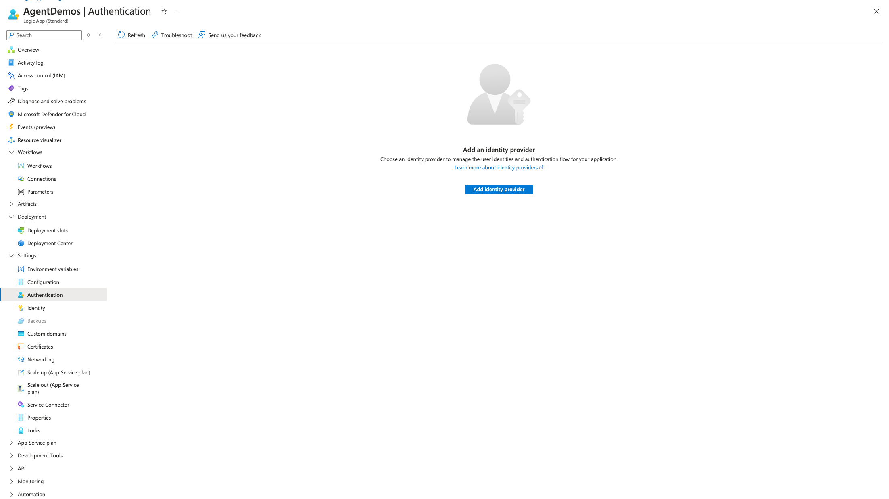
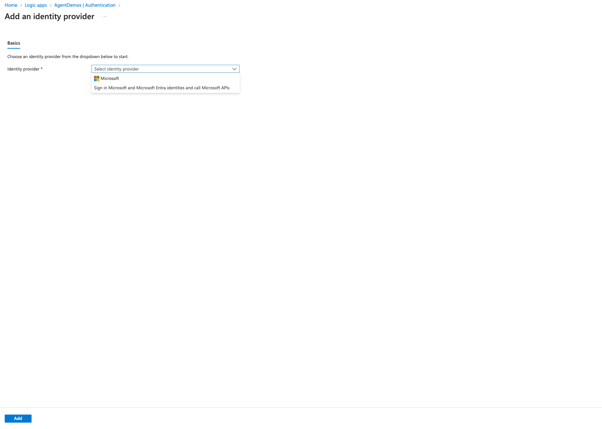
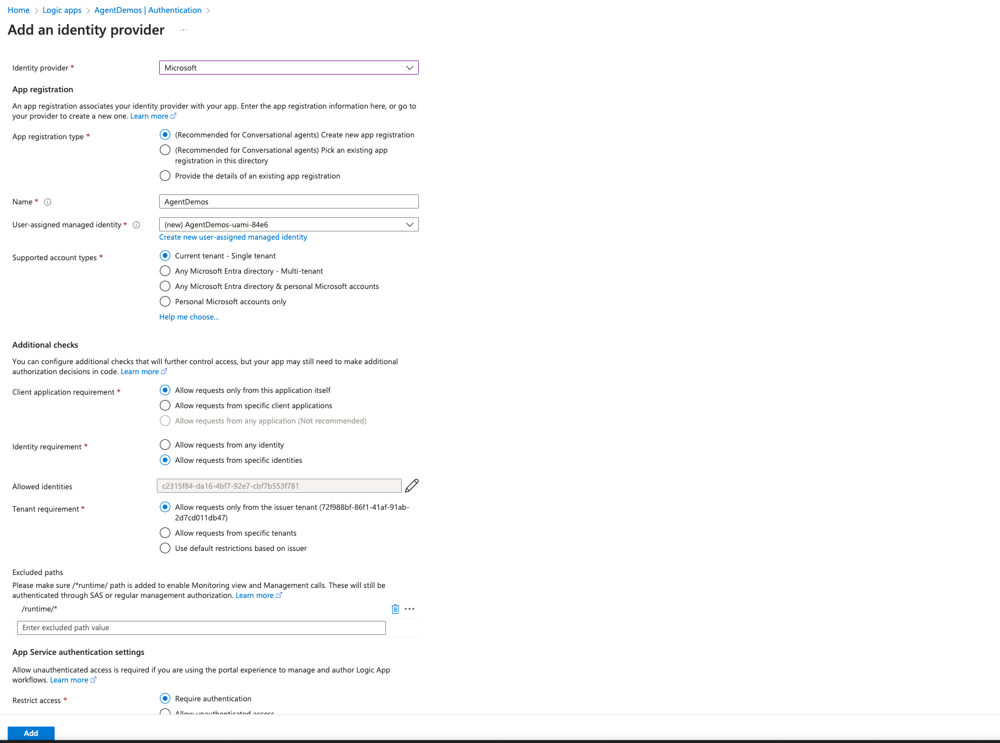
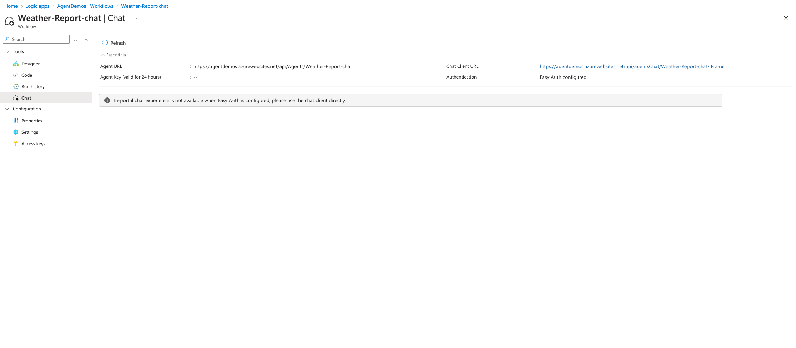

--- 
title: 06 - Deploy your agents and clients
description: Learn how to deploy Logic Apps conversational agents and built-in chat client, configure authentication and developer identity, and link to existing Logic Apps deployment workflows.
ms.service: logic-apps
ms.topic: tutorial
ms.date: 09/03/2025
author: krmitta
ms.author: krmitta
---

In this module, you learn how to deploy your Azure Logic Apps conversational agent, use the built-in chat client, configure authentication or use the developer identity for development purposes.

When you finish this module, you'll achieve the goals and complete the tasks in the following list:

- Have a conversational agent you can chat with in the Azure portal.
- Understand key concepts for conversational agents in Azure Logic Apps.
- See basic tool execution and agent reasoning.
- Understand the basics of the agent-to-agent (A2A) protocol (high-level).
- Use the built-in chat client to debug, test and enhance your agent on the go.
- Use the chat client with proper authentication flow(using Easy Auth, previously known as App Service Authentication) for your production use-case.

## Prerequisites

- An Azure account and subscription. If you don't have a subscription, [sign up for a free Azure account](https://azure.microsoft.com/free/?WT.mc_id=A261C142F).

- A Standard logic app resource and a conversational agent workflow with the model that you set up in previous modules.

  If you don't have this workflow, see [Module 01 - Create your first conversational agent](01-create-first-conversational-agent.md).

## Chatting with your agent

### Step 1 - Using the in-built chat client (Strongly recommended for development purposes only)
Conversational agent workflows provide you with an in-built chat client in Azure portal which you can use for debugging the testing your workflow.
1. Make sure your workflow is running, if not, hit run from the designer or the Run history blade.
2. Go to chat blade and wait for the client to load fully.
3. Use any of the existing chat threads or start a new one and start chatting with your agent.

### Goals

- Easily debug, test, and iterate over your agent definition to further enhance it.
- Chat client uses the A2A protocol and OBO connection to mimic your production scenrios so get a first hand feel of how your agent will behave when a user chats with it.

### Step 2 - Using the chat client as an iframe or directly as a standalone application

### Step 2a - Setup Easy Auth (previously known as App Service authentication)
This is required for the standalone chat client application
1. Go to Authentication blade for your Azure Logic App.

1. Add Identity provider and select Microsoft as the provider.

1. For Conversational Agents, we recommend either Creating a new app registration or use an existing registration. This helps you get the settings out of box since we can help setup everything for you. 

With the recommended options, we default all the required configurations for Conversational agents.
  - Authentication is secure by default since it is tied down to your ClientId (Under Allowed Identities).
  - Excluded paths include "/runtime" to make sure monitoring and other APIs continue to work.
  - Token store is enabled by default.
  - Unauthenticated request use the Http 302 redirect.
If in case you bring your own app registration, make sure to apply the relevant configurations manually.

### Step 2b - Using the standalone chat client
1. Make sure your workflow is running, if not, hit run from the designer or the Run history blade.
2. Go to chat blade and follow the chat client uri to open the standalone experience.

1. The Chat client here is using Easy auth you configured in Step 2a and can be used directly for production scenarios.

### Review supported authentication
Azure Logic Apps conversational agents support two authentication methods:

- **API key-based authentication**: This is the default method. The API key (also referred to as the developer key) must be included in the X-API-Key header for any communication with the agent.
This authentication method is used in the in-built chat client hosted in the Azure portal.

- **App Service authentication (EasyAuth)**: If EasyAuth is configured on the logic app, it takes precedence over API key-based authentication. This method is typically used when OAuth flows or on-behalf-of (OBO) scenarios are required, such as interacting with connectors that require user context (explained in the extension modules - [Add user context to your tools](./04-add-user-context-to-tools.md)).
This is a secure by-default authentication method which is used in the chat client(explained in Step 2) provided as an iframe that can be used directly or embedded in your client application.

## Related content

- [Create First Conversational Agent](./01-create-first-conversational-agent.md)
- [Connect your tools to external services](./03-connect-tools-external-services.md)
- [Connect your agents with A2A protocol](./05-connect-agents-a2a-protocol.md)

