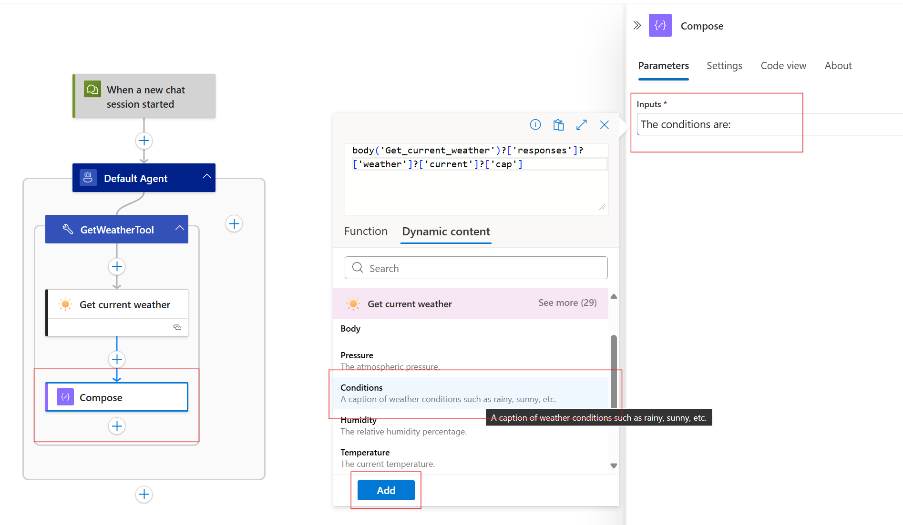
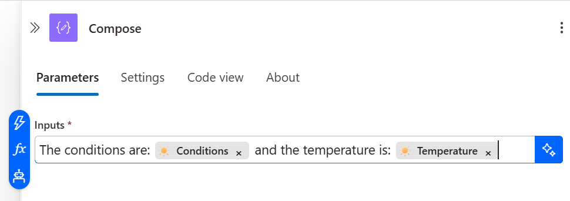
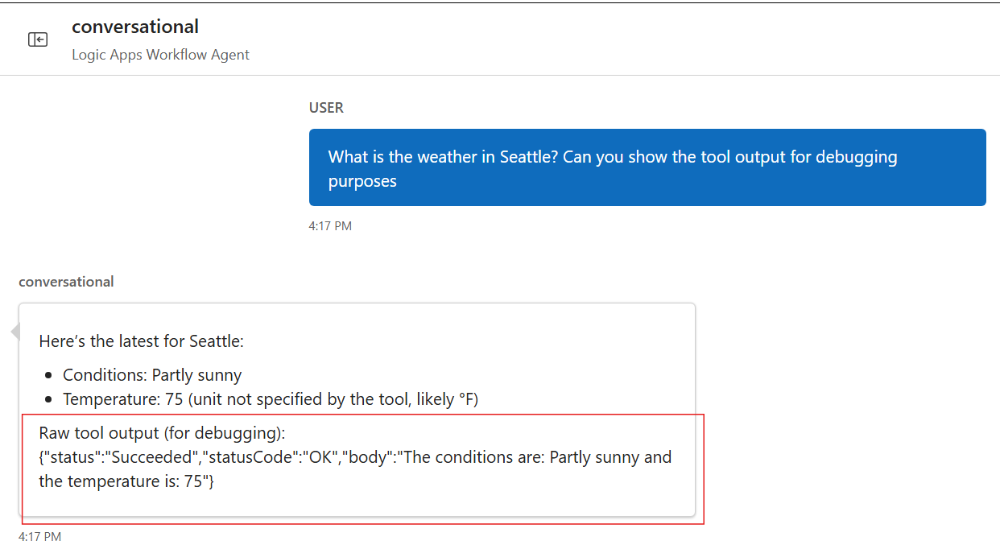

--- 
title: 06 - Extend your tool functionality with patterns
description: Learn how to extend tool functionality in Logic Apps conversational agents using patterns such as mocking with compose actions, multi-action tool branches, guardrails, and output transformation to improve testing, safety, and formatting.
ms.service: logic-apps
ms.topic: tutorial
ms.date: 08/27/2025
author: karansin
ms.author: karansin
---

This module describes several common tool patterns:
- Mocking tool output
- Adding multiple actions per tool
- Transforming tool output
- Complex control flow in tools via nested workflows
- Parallel tool execution
- Human-in-the-loop

## Mocking tool output

When developing your agent, it can be helpful to iterate on high-level agent design (model selection, system prompt, tool metadata) without real tool execution. For example, you may want to defer connector configuration or avoid side effects.

To accomplish this, you can mock tool output in two ways:
- Use a Compose action
- Use static results

### Mocking using Compose action

1. When implementing the tool, instead of configuring your intended connector, select "Compose" action. This is a built-in action in Logic Apps that allows you to compose static or dynamic values into a final result.
2. Replace the Compose action Inputs with the value you would like the tool to return.
3. When executing the tool, the Compose action will return your provided value as-is.

See the `EchoTool` example in module four.

### Mocking using static results

Consult [this documentation](https://learn.microsoft.com/en-us/azure/logic-apps/testing-framework/test-logic-apps-mock-data-static-results?tabs=standard) to set up static results on the action whose execution you would like to mock.

## Adding multiple actions per tool branch

So far, all our examples have had one Logic App action per agent tool branch. You also have the option to add multiple linear actions. To do this, simply select the "Add" button within a tool to set up multiple actions.

When a tool completes execution, the results must be sent back to the LLM for interpretation. In Logic Apps, the result of the **final** action in your tool branch becomes the tool output.

## Transforming tool output

The final action in your tool branch may return an intermediate payload that you want to transform further before sending back to LLM for interpretation.

This capability has several use cases:
- Reduce overall token count by only sending minimal information to LLM
- Improve agent quality by filtering out unnecessary information from the tool output
- By default, the last action output becomes the tool output. If you have a chain of several actions, you can construct a custom tool output payload that combines properties from multiple action outputs. 

This can again be accomplished with the Compose action. For example, the imagine a simple weather agent similar to the one we built in module four. When reviewing execution in the monitoring view, we see the `functionCallResult` that was sent back to the LLM:

```json
[
  {
    "role": "Tool",
    "authorName": "Default_Agent",
    "functionName": "GetWeatherTool",
    "functionCallId": "call_ZIhZoKfzNqNNC1sHiCzldA7w",
    "functionCallResult": {
      "status": "Succeeded",
      "statusCode": "OK",
      "body": {
        "statusCode": 200,
        "headers": {
          "Transfer-Encoding": "chunked",
          "Vary": "Accept-Encoding",
          ...
          "Date": "Thu, 04 Sep 2025 17:28:25 GMT",
          "Content-Type": "application/json; charset=utf-8",
          "Content-Length": "5988"
        },
        "body": {
          "responses": {
            "weather": {
              "alerts": [],
              "current": {
                "baro": 29.95,
                "cap": "Mostly sunny",
                "capAbbr": "Mostly sunny",
                "daytime": "d",
                "dewPt": 61,
                "feels": 80,
                "rh": 90,
                "icon": 2,
                "symbol": "d1000",
                "pvdrIcon": "2",
                "urlIcon": "http://img-s-msn-com.akamaized.net/tenant/amp/entityid/AAehR3S.img",
                "wx": "",
                "sky": "FEW",
                "temp": 64,
                "tempDesc": 7,
                "utci": 80,
                "uv": 1,
                "uvDesc": "Low",
                "vis": 8.1,
                "windDir": 254,
                "windSpd": 2,
                "windTh": 13.6,
                "windGust": 4,
                "created": "2025-09-04T17:10:49+00:00",
                "pvdrCap": "Mostly sunny",
                "aqi": 61,
                "aqiSeverity": "Moderate air quality",
                "aqLevel": 20,
                "primaryPollutant": "PM2.5 0.0 μg/m³",
                "aqiValidTime": "2025-09-04T17:05:00+00:00",
                "richCaps": [],
                "cloudCover": 29
              },
              "nowcasting": {
                "precipitation": [
                  0,
                  0,
                  0,
                  0,
                  0,
                  0,
                  0,
                  0,
                  0,
                  0,
                  0,
                  0,
                  0,
                  0,
                  0,
                  0,
                  0,
                  0,
                  0,
                  0,
                  0,
                  0,
                  0,
                  0,
                  0,
                  0,
                  0,
                  0,
                  0,
                  0,
                  0,
                  0,
                  0,
                  0,
                  0,
                  0,
                  0,
                  0,
                  0,
                  0,
                  0,
                  0,
                  0,
                  0,
                  0,
                  0,
                  0,
                  0,
                  0,
                  0,
                  0,
                  0,
                  0,
                  0,
                  0,
                  0,
                  0,
                  0
                ],
                "precipitationRate": [
                  0,
                  0,
                  0,
                  0,
                  0,
                  0,
                  0,
                  0,
                  0,
                  0,
                  0,
                  0,
                  0,
                  0,
                  0,
                  0,
                  0,
                  0,
                  0,
                  0,
                  0,
                  0,
                  0,
                  0,
                  0,
                  0,
                  0,
                  0,
                  0,
                  0,
                  0,
                  0,
                  0,
                  0,
                  0,
                  0,
                  0,
                  0,
                  0,
                  0,
                  0,
                  0,
                  0,
                  0,
                  0,
                  0,
                  0,
                  0,
                  0,
                  0,
                  0,
                  0,
                  0,
                  0,
                  0,
                  0,
                  0,
                  0
                ],
                "precipitationAccumulation": [
                  0,
                  0,
                  0,
                  0,
                  0,
                  0,
                  0,
                  0,
                  0,
                  0,
                  0,
                  0,
                  0,
                  0,
                  0,
                  0,
                  0,
                  0,
                  0,
                  0,
                  0,
                  0,
                  0,
                  0,
                  0,
                  0,
                  0,
                  0,
                  0,
                  0,
                  0,
                  0,
                  0,
                  0,
                  0,
                  0,
                  0,
                  0,
                  0,
                  0,
                  0,
                  0,
                  0,
                  0,
                  0,
                  0,
                  0,
                  0,
                  0,
                  0,
                  0,
                  0,
                  0,
                  0,
                  0,
                  0,
                  0,
                  0
                ],
                "previousPrecipitation": [],
                "symbols": [],
                "previousSymbols": [],
                "templateType": "NoRain",
                "minutesToTransit": 0,
                "summary": "No precipitation for at least 2 hours.",
                "shortSummary": "No precipitation for at least 2 hours",
                "taskbarSummary": "No precip. for 120m",
                "horrizonCount": 58,
                "minutesBetweenHorrizons": 4,
                "enableRainSignal": false,
                "raintype": "nr",
                "timestamp": "2025-09-04T17:20:00+00:00",
                "weathertype": 255,
                "nowcastingDistance": 94,
                "nearbyPrecipitationType": 0,
                "taskbarSummaryL1": "",
                "taskbarSummaryL2": ""
              },
              "contentdata": [
                {
                  "id": "wxnw",
                  "cid": 0,
                  "ranking": 2000,
                  "contenttype": "NormalWeather",
                  "isSpotlight": false
                }
              ],
              "provider": {
                "name": "Foreca",
                "url": "http://www.foreca.com"
              },
              "aqiProvider": {
                "name": "wxforecast"
              }
            },
            "source": {
              "id": "105809844",
              "coordinates": {
                "lat": 47.60620880126953,
                "lon": -122.33206939697266
              },
              "location": "Seattle, WA",
              "utcOffset": "-07:00:00",
              "countryCode": "US"
            }
          },
          "units": {
            "system": "Imperial",
            "pressure": "in",
            "temperature": "°F",
            "speed": "mph",
            "height": "in",
            "distance": "mi",
            "time": "s"
          },
          "userProfile": {
            "used": {
              "geoCoordinates": {
                "latitude": 47.60300064086914,
                "longitude": -122.33000183105469,
                "altitude": 0,
                "version": 0
              }
            }
          },
          "copyright": "Copyright © 2025 Microsoft and its suppliers. All rights reserved. This API cannot be accessed and the content and any results may not be used, reproduced or transmitted in any manner without express written permission from Microsoft Corporation."
        }
      }
    }
  }
]
```

The full payload is [described here](https://learn.microsoft.com/en-us/connectors/msnweather/#currentweather) in the API documentation. Let's say the agent only needs two fields: `responses.weather.current.cap` (a caption of weather conditions such as rainy, sunny, etc.) and `responses.weather.current.temp` (the current temperature). To transform tool output in this way, we append a Compose action to the end of the tool branch. Since tool branches inherit the result of their last action, the Compose action can form an expression referencing just the dynamic outputs we need.



Note that in the above screenshot, a few things have changed:
- Our tool branch is now a linear sequence of actions. A compose action is placed after the MSN weather connector
- The inputs of the compose action have some static text alongside in-progress addition of dynamic content from the prior action outputs
- In the expression selector, we can select the relevant values to interpolate them into the inputs of the compose action. Since the compose action returns its input, and tool branches inherit the output results of their final action, the input value we form here will replace the prior full payload.



In the above screenshot, we finalize the expression by including both the caption and the temperature.



In the above screenshot, we see this pattern leveraged in a conversational flow. Notice that the tool output provided to the LLM matches the schema we specified in the Compose action, not the full JSON blob from before. This can also be confirmed in the monitoring view.

This pattern has a few benefits:
- We reduce unnecessary token usage (tool outputs are included in LLM token count).
- We only send the information we need to the LLM. This improves agent quality and robustness.

## Complex control flow in tools via nested workflows

By default, a tool branch can contain linear actions. If you want more complex control flow in your tool, you can implement the tool as a separate deterministic Logic Apps workflow. You can then invoke the nested workflow in your tool. This allows complex control flow and also further decouples the tool implementation from the agent design. For example, if you take this approach, you can test the nested workflow independently from its agent usage.

## Parallel tool execution

Many LLM providers have support for parallel tool execution. For example, a weather agent asked for data about both Seattle and Paris can invoke the tool twice in parallel with different inputs. This is supported by default in Logic Apps agents - the monitoring view will allow you to trace the execution of each tool.

## Human-in-the-loop

Many agents require human intervention - for example, certain actions should wait for approval or need structured information from the user. One way to accomplish this is to first identify an appropriate webhook action that defers completion until some condition is met. Some services have existing actions that support this pattern. For example, Teams has the ["Post adaptive card and wait for a response" action](https://learn.microsoft.com/en-us/connectors/teams/?tabs=text1%2Cdotnet#post-adaptive-card-and-wait-for-a-response) and Outlook has the ["Send approval email" action](https://learn.microsoft.com/en-us/connectors/office365/#send-approval-email). You can [extend this pattern into any service](https://learn.microsoft.com/en-us/azure/logic-apps/logic-apps-create-api-app#perform-long-running-tasks-with-the-webhook-action-pattern) by using the webhook action.

We assume this webhook approval action will be leveraged to notify and wait for approval. Once the action is identified, there are two ways to integrate this into the agent:

Approach A: The webhook action and target action reside in different tools and LLM stages them sequentially. This approach has the following characteristics:
- A generic approval tool can be reused for different target actions.
- We describe approval requirements in directives to the LLM like system prompt and tool metadata. For example: `You are an agent. When executing tool A, always get approval beforehand via tool B.`
- The LLM results control when the webhook action executes, how to interpret the webhook results, and when the target action executes post-approval. This behavior depends on the system prompt, tool metadata, and user messages. Since behavior is dynamic and probabilistic, the webhook and target action are not guaranteed to run together.

Approach B: The webhook action and target action reside in the same tool implemented as a nested workflow where the approval/webhook action runs first. The webhook result parsing & conditional target action invocation is all handled deterministically.
- The target action will **never** run without corresponding webhook action results.
- While the LLM completion results control when the overall tool runs, the corresponding approval flow is fully deterministic without LLM involvement.

The right design depends on your scenario and target action details - but be sure to consider whether your flow would benefit from these deterministic elements.
