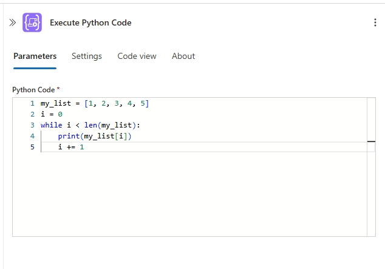
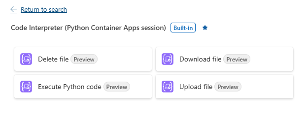
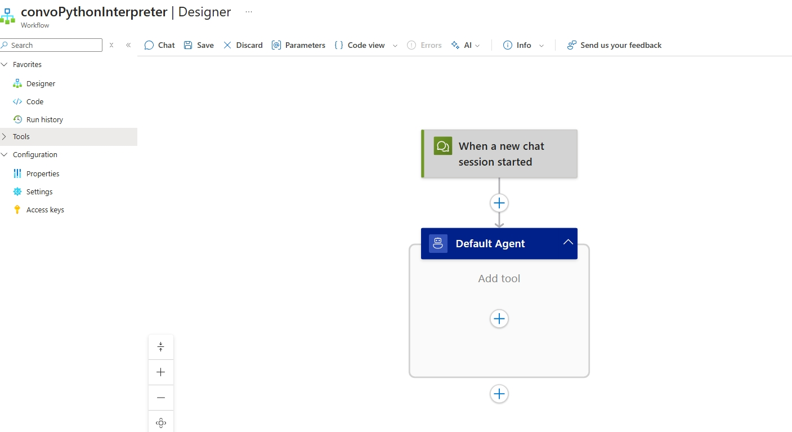
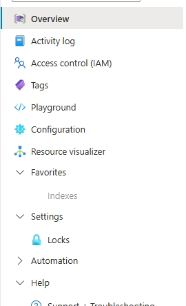
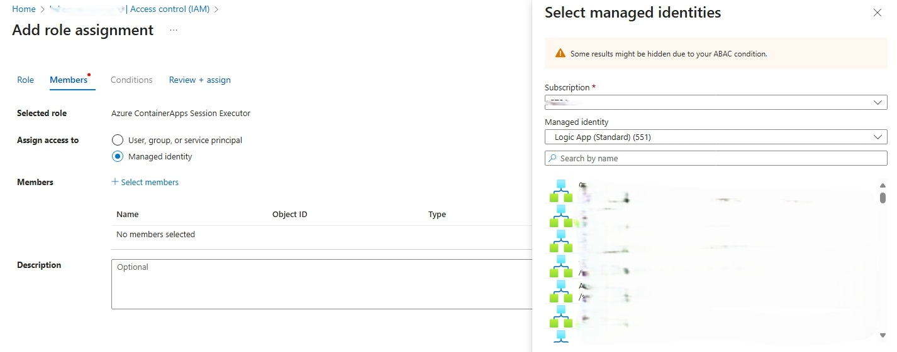
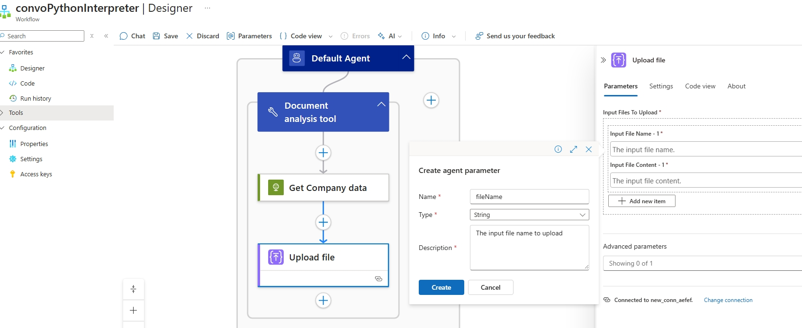
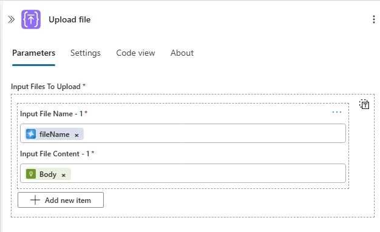
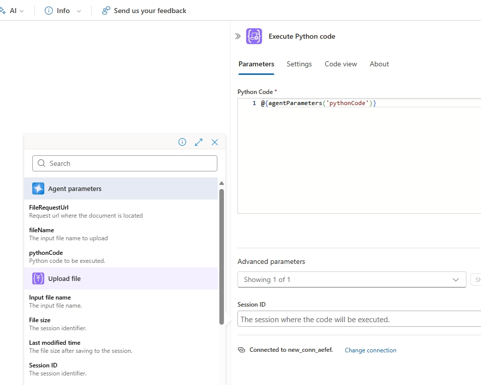
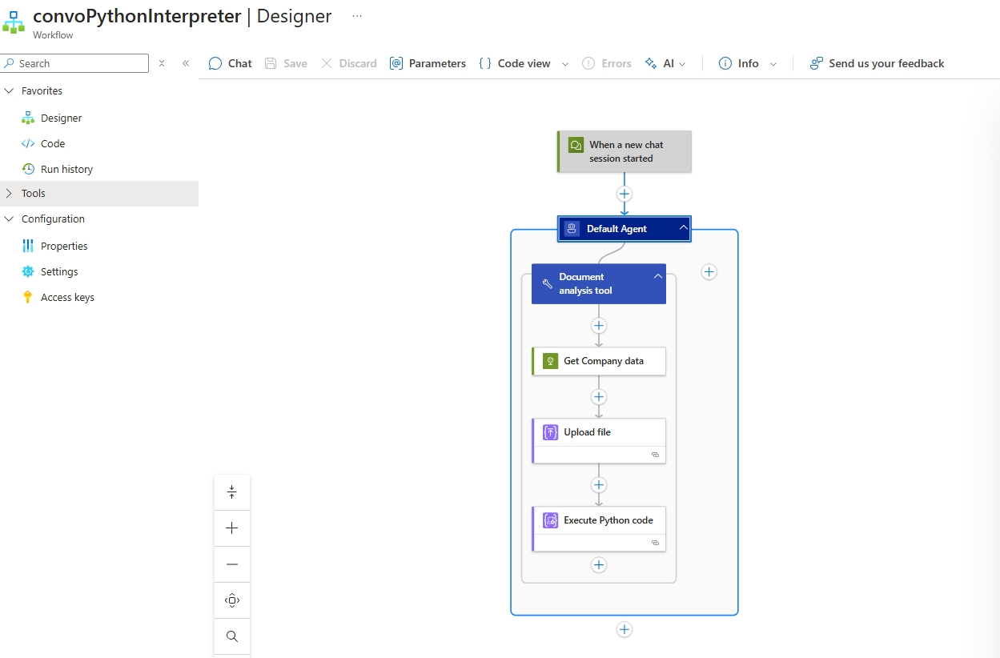
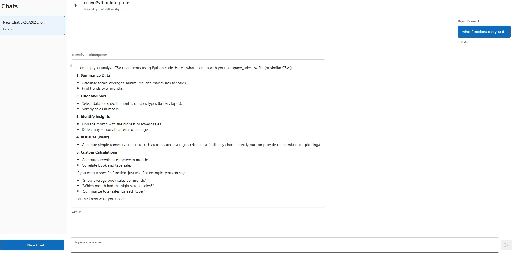

This module explains how to extend the functionality of Azure Logic Apps workflows and agents with built-in tools.

When finished with this module, you'll have gain the following knowledge:

- **Python Integration Capabilities**: How to leverage Python's data processing power within Logic Apps workflows for complex computations, statistical analysis, and structured data manipulation
- **LLM-Generated Code Execution**: How to enable agents to automatically convert natural language instructions into executable Python scripts, eliminating the need for manual coding expertise
- **End-to-End Data Analysis Automation**: How to build complete workflows that ingest data, perform analysis, generate reports with visualizations, and distribute results automatically
- **Multi-Language Code Support**: Understanding of how Python, JavaScript, C#, and PowerShell can be integrated into agent workflows for different computational needs

## Python for Data Analysis and Custom Computations

Python excels at handling structured data and performing complex computations within Logic Apps workflows, offering several key advantages:

### **Structured Data Processing**
- **JSON/XML Parsing**: Efficiently parse and manipulate complex nested data structures
- **Data Transformation**: Convert between formats, clean data, and reshape structures
- **Array Operations**: Process large datasets with built-in list comprehensions and filtering
- **Pattern Matching**: Use regular expressions and string manipulation for data extraction

### **Mathematical and Statistical Computations**
- **Statistical Analysis**: Calculate means, medians, standard deviations, and correlations
- **Business Logic**: Implement complex formulas for pricing, scoring, or risk calculations
- **Data Validation**: Perform custom validation rules that go beyond simple type checking
- **Aggregations**: Sum, count, group, and analyze data across multiple dimensions

### **Integration Benefits in Logic Apps**
- **Dynamic Logic**: Handle business rules that are too complex for native Logic Apps expressions
- **External Library Access**: Leverage Python's extensive ecosystem (pandas, numpy, etc.)
- **Custom Algorithms**: Implement proprietary calculations or machine learning models
- **Error Handling**: Robust exception handling for data processing operations

This section explores the Python code interpreter action in Logic Apps which bridges the gap between simple workflow automation and sophisticated data processing, enabling you to build intelligent agents that can reason about complex data patterns and perform advanced computations on demand.

## Using the Python action for user-written code
The Python code interpreter action can be add to standard workflows, enabling you to execute your own Python code. This integration is useful when you have custom code you want to run. 



## Using the Python action for LLM-generated code
The Python code interpreter action can be integrated into agent workflows, enabling users to reference LLM-generated code directly as input for the action. This feature streamlines workflows by enabling natural language instructions to be automatically converted into executable Python scripts, allowing for rapid data analysis, cleaning, and visualization without the need for manual coding or advanced data science skills. Users do not need to be fluent in Python, and the generated code is designed to be accurate and executable. 

The Python interpreter action is accompanied by additional actions to enable you to managage files on your ACA code interpreter session. Those actions include the ability to upload, download, and a delete files as seen below.



### Benefits of running code inside of a ACA session

- **Scalability and Performance**: Azure Container Apps (ACA) provide on-demand compute resources, allowing code to scale automatically based on workload, ensuring efficient execution even for large or complex tasks.
- **Isolation and Security**: Code runs in a secure, isolated container environment, reducing risks associated with dependency conflicts and unauthorized access to sensitive data or resources.
- **Flexible Environment Management**: Easily customize the runtime environment with specific libraries, dependencies, and configurations tailored to your workflow or agent requirements.
- **Seamless Integration with Logic Apps**: ACA sessions can be orchestrated directly from Logic Apps, enabling automated, event-driven execution of code as part of broader business processes.

More on ACA Code interpreter sessions here [ACA sessions in Azure Container Apps](https://learn.microsoft.com/en-us/azure/container-apps/sessions-code-interpreter).

## Document Analysis Agent
The example below demonstrates an agent workflow that leverages the Python code interpreter to analyze company sales data. The agent receives system instructions to generate Python code to answer user questions. The workflow is powered by a **Document Analysis tool** branch which performs the following:

1. Ingests company data from Azure storage
2. Uploads the data to the Azure Container Apps Code Interpreter session
3. Executes LLM-generated Python code to analyze sales trends
4. Returns the Python-generated answer back into the workflow agent

This architecture enables end-to-end automation of complex data analysis tasks, from data ingestion through questions answering.

### Step 1 - Set up your agent

> :::note
> Prerequisite for this module is that you have access to an Azure Container App Python Code Interpreter session pool. For steps on setting this resource up, follow the guide here [Use session pools in Azure Container Apps](https://learn.microsoft.com/en-us/azure/container-apps/session-pool?tabs=azure-cli).

1. In the [Azure portal](https://portal.azure.com), open your Standard logic app resource.

1. Find and open your conversational agent workflow in the designer.

   

1. On the designer, select the agent action. Rename the agent: **Document analysis agent**. Next enter the System Instructions, then click **Save** to save your workflow changes.  

```
You are a helpful document analysis agent. When a question is asked, follow these steps in order: 

Document Analysis: 

Write Python code to analyze the input CSV file provided in chat. Use the file location to download the file by setting the 'fileRequestURL'.  Once uploaded the file will be located at '/mnt/data/company_sales.csv'. Set the fileName parameter to 'company_sales.csv'. The CSV file's first row contains the column titles: 'Month', 'Book sales', and 'Tape sales'. The first column lists the month names.  

Pass this Python code as a string to the python tool using the parameter pythonCode. 
Use minimal python libraries for completing the task. Print the result to the stout.

```

> :::note 
> Agent prompt best practices: 
> - Be descriptive as possible with the steps you want the agent to perform
> - Organizing the instructions with section titles gives the agent hint on how to group the its steps
> -  Files uploaded to an ACA Python interpreter session will be located at the directory **/mnt/data/**, be sure to include this when referencing files in your system prompt to ensure the agent knows where to find the file
> - When downloading a file from an ACA Python interpreter session, the file will be located at the directory **'/mnt/data/** (the same directory as uploaded files). More on working with files in an ACA session [Work with files](https://learn.microsoft.com/en-us/azure/container-apps/sessions-code-interpreter#work-with-files)

#### Enable Role based access to your ACA Session Pool

1. Close the workflow designer and exist back to your Logic App Overview.
1. In the Overview menu, on the left-side menu select the **Identity** menu item under the **Settings** main menu items.  
      

1. On the **System assigned** tab, turn **Status** on by selecting the *On* button. Then click the **Save** button.  
    
1. Go to your ACA Python Code Interpreter Session pool.
2. Select **Access control (IAM)** from the left-side menu item.  
    

1. On the **Access control (IAM)** page click the **+Add** button to add a new role assignment.
1. On the **Add role assignment** page select the **Azure ContainerApps Session Executor** role, then click **Next**.
1. From the **Members** tab, on the **Assign access to** option click **Managed identity**, then click **+ Select members**.
1. From the right-side openned dialog box, select the Subscription where your Logic App was created, then under **Managed identity** drop down select **Logic App (Standard)**, lastly, in the search box type the name of your workflow, then select it.
   
1. Click the **Select** button to close the diaglog box.
1. Click the **Review + assign** button to complete the role assignment.


### Step 2 - Add the Document Analysis tool to your agent

1. On the designer, inside the agent, select the plus sign (+) under **Add tool**.

1. Click on the Tool, and rename it to **Document analysis tool**. Then add the following Description **Analyzes a file using a python code interpreter.**.

1. Add the **HTTP** action and rename it to **Get Company data**.

   

   1. For the **URI** parameter, create an Agent parameter using the following values:
      - Name: **FileRequestUrl**
      - Type: **String**
      - Description: **Request url where the document is located**
     > :::note The file used in this module can be found here [company_sales.csv](media/08-extend-tools-with-code/company_sales.csv)

1. Add the **Upload file** action from the to ACA Session connector. For inputs we will use the output body of the **Get Company data** action and then create a new Agent parameter.
   1. Set the **File Name** property by creating an Agent parameter using the following values:
      - Name: **fileName**
      - Type: **String**
      - Description: **The input file name to upload**
   1. Set the **File Content** property to the body output of the **Get Company data**.

      

      

1. Add the **Execute Python code** action from the ACA Session connector. For inputs we will use a new Agent action and the output SessionId parameter from the **Get Company data** action. We must ensure the Python code is executed in the same session as where the file was uploaded.

   

   

1. Save your workflow. The final design will look like the following.
   

### Step 3 - Test your workflow in Chat experience
> :::note 
> The company_data.csv file used in this example can be found here [company_sales.csv](media/08-extend-tools-with-code/company_sales.csv)

1. Go back to your Logic Apps resource, and find your workflow. On the designer toolbar, select **Chat**.

   

1. In the chat client interface, ask the following question: **Using the file located at `{insert url file location}`, can you tell me what the total Book sales were for the year?**

   

### Step 4 - Check execution in monitoring view
 1. On the workflow sidebar, under **Tools**, select **Run history**.
 1. Select the most recent workflow run.
 1. Confirm the agent successfully generated Python code for analyzing the document.

    

For more information, see [Module 2 - Debug your agent](02-debug-agent.md).

## How to use other custom code actions in agent context
The JavaScript, C#, and PowerShell actions can also be used within an agent workflow. The user can supply their own code or allow the LLM to generate it. 
- More on the JavaScript action: [Add and run JavaScript code inline with workflows for Azure Logic Apps](https://learn.microsoft.com/en-us/azure/logic-apps/add-run-javascript?tabs=standard)
- More on the C# action: [Add and run C# scripts inline with Standard workflows for Azure Logic Apps (Preview)](https://learn.microsoft.com/en-us/azure/logic-apps/add-run-csharp-scripts)
- More on the PowerShell action: [Add and run PowerShell scripts in Standard workflows for Azure Logic Apps (Preview)](https://learn.microsoft.com/en-us/azure/logic-apps/add-run-powershell-scripts)
