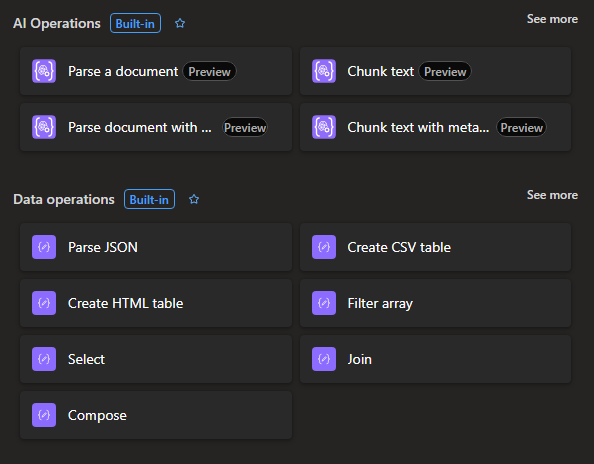
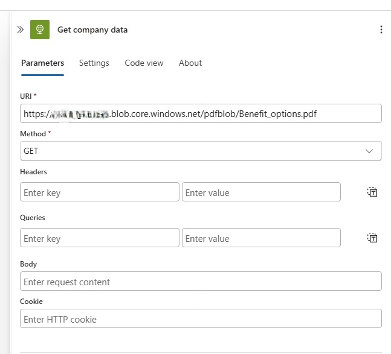
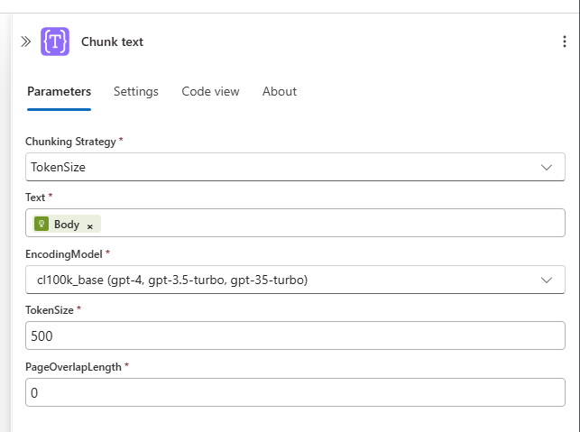
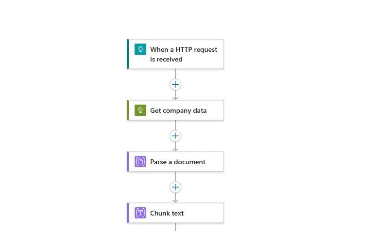
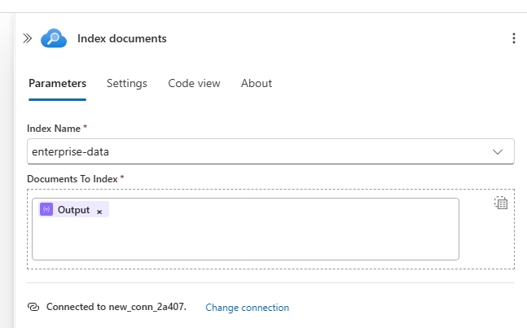
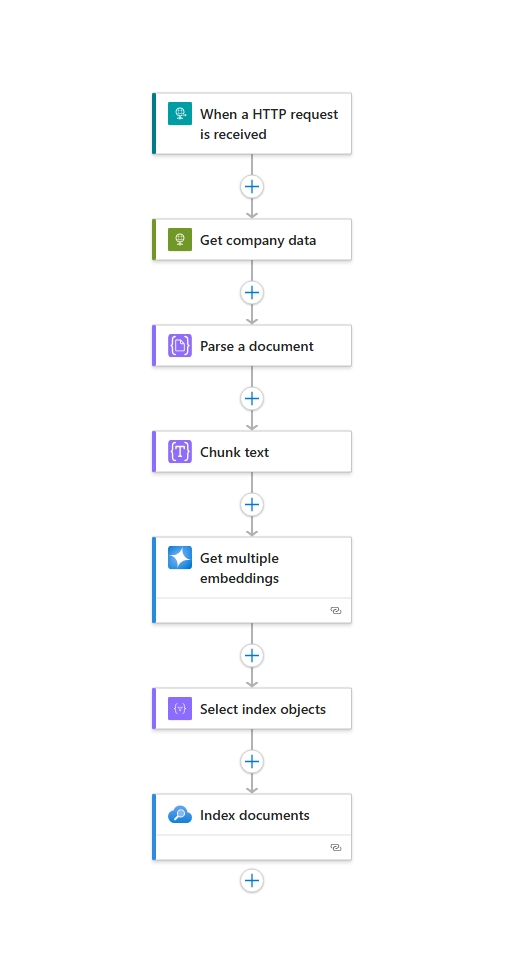
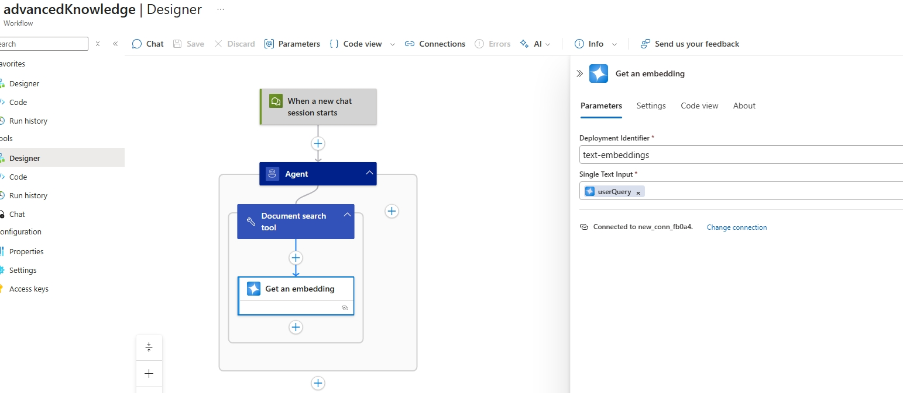

This module explains how to use advanced techniques to add custom knowledge to your Azure Logic Apps agents using RAG ingestion and retrieval.

When finished with this module, you'll have gain the following knowledge:

- **RAG Architecture Understanding**: How to implement the two-phase RAG pattern in Logic Apps, including data ingestion/indexing and conversational retrieval/response generation
- **Enterprise Data Integration**: How to leverage Logic Apps' 1,400+ connectors to ingest and process knowledge from diverse sources including documents, databases, APIs, and enterprise systems
- **Knowledge Agent Creation**: How to transform unstructured documents into knowledge agents for answer domain specific questions
- **Azure AI Search Implementation**: How to use Azure AI Search for enterprise-grade semantic search, vector search, and hybrid search capabilities to enhance agent responses

## The Power of RAG in AI Applications

Retrieval-Augmented Generation (RAG) represents a transformative approach to building intelligent conversational agents that can access and leverage external knowledge sources in real-time. By combining the generative capabilities of Large Language Models (LLMs) with dynamic information retrieval, RAG enables AI applications to provide accurate, contextual, and up-to-date responses that go far beyond the limitations of pre-trained model knowledge.

### RAG in Logic Apps: Bridging AI and Enterprise Data

Logic Apps provides multiple pathways to implement RAG patterns, from simple data composition to sophisticated AI Search integrations. This module explores various approaches to enriching your conversational agents with organizational knowledge, enabling them to become truly intelligent assistants that understand your business context.

## Implementation Approach

RAG implementation in Azure Logic Apps follows a two-phase architecture that transforms your enterprise data into intelligent, conversational experiences:

### Phase 1: Data Ingestion and Indexing
In this foundational phase, Logic Apps orchestrates the process of bringing your data into the AI ecosystem. Your documents, databases, and content sources are processed through Logic Apps workflows that:
- **Parse and extract** text content from various file formats (PDFs, Word docs, web pages, etc.)
- **Transform and chunk** the data into manageable segments for optimal retrieval
- **Generate embeddings** using AI models to create vector representations of your content
- **Index the embeddings** in specialized data stores like Azure AI Search, Azure Cosmos DB, or vector databases

### Phase 2: Conversational Retrieval and Response Generation
When users interact with your agent, Logic Apps handles the intelligent retrieval and response process:
- **Process user questions** by converting them into embedding vectors using the same AI models
- **Search the knowledge base** to find the most semantically similar content to the user's query
- **Retrieve relevant context** from the indexed data store based on similarity scores
- **Combine retrieved information** with the user's question and send to the LLM
- **Generate contextual responses** that are grounded in your organizational knowledge

This two-phase approach ensures that your conversational agents can access and reason about your specific data while maintaining the natural language capabilities of modern LLMs.

Azure Logic Apps provides a comprehensive suite of document processing and transformation actions that enable seamless data ingestion from diverse sources and document formats.



## Document Ingestion for Gen AI Applications

With over 1,400 enterprise connectors, Logic Apps provides unparalleled access to a wide range of systems, applications, and databases, making it easier than ever to create powerful generative AI applications. By leveraging connectors like Azure OpenAI and Azure AI Search, businesses can seamlessly implement the Retrieval-Augmented Generation (RAG) pattern, allowing the ingestion and retrieval of data from multiple sources with ease.

[Document Ingestion for Gen AI Applications using Logic Apps from 1000+ data sources!](https://techcommunity.microsoft.com/blog/integrationsonazureblog/document-ingestion-for-gen-ai-applications-using-logic-apps-from-1000-data-sourc/4250675)

## Part 1 - Data ingestion and Indexing
> :::note
> Prerequisites for this module are the following
> - You have access to an Azure Storage Account resource. For steps on setting this resource up, follow the guide here [Create an Azure storage account](https://learn.microsoft.com/en-us/azure/storage/common/storage-account-create?tabs=azure-portal).
>- You have a upload a pdf document to your storage resource. The link to this resource will be used in the next steps. The pdf used in this module can be download here [Benefit_Options.pdf](media/03-add-knowledge-to-agent/Benefit_Options.pdf) 
> - You have access to an Open AI Service and this service has a deployed model for generating text embeddings. For more on creating this service visit [Explore Azure OpenAI in Azure AI Foundry](https://learn.microsoft.com/en-us/azure/ai-foundry/openai/tutorials/embeddings?source=recommendations&tabs=command-line%2Cpython-new&pivots=programming-language-python).
> - You have access to an Azure AI Search service. For more on creating this resource visit here [Create an Azure AI Search service](https://learn.microsoft.com/en-us/azure/search/tutorial-optimize-indexing-push-api#create-an-azure-ai-search-service). Additionally, this module assumes your search index is created using this index schema: [index_schema](media/04-extend-knowledge-to-agent/index_schema.json)

### Step 1 - Create our data ingestion worflow

1. In the [Azure portal](https://portal.azure.com), open your Standard logic app resource.
1. Create a new standard workflow
1. Add a **Request** trigger.
1. Add the **HTTP** action and rename it to *Get company data* Set the **URI** property to the the link of the *Benefit_Options.pdf* that was upload to your Azure storage. Set the **Method** property to *GET*.
   

1. Add the **Parse a document** action. Set the **Document Content** property to the value "*@body('Get_Company_data')*".
1. Add the **Chunk text** action. Set the **Text** value to "*@body('Parse_a_document')*" and set the **TokenSize** 
property to *500*. All other property can remain their default values.
     
   At this point your workflow should resemble the follow:
   
1. Add the **OpenAI-Get Embeddings** action. Connect this action to your OpenAI Service. Set the **Deployment Identifier** property to the name of your text embeddings deployment. Set the **Array Input** property to the value "*@body('Chunk_text')?['value']*".
   
1. Add the **Select** action and rename it to **Select index objects**. Set the **From** property to "*@range(0, length(body('Select_chunks')))*". Set the **Map** property to the value:
  
```
{
 "content" : @body('Select_chunks')[item()],
 "documentName" : "Benefit_Options_.pdf",
 "embeddings" : @body('Get_multiple_embeddings')['embeddings'][item()],
 "id" : @guid()
}
```
  
1. Add the **Azure AI Search-Index documents** action, and rename it to **Index documents**. Connect this action to your Azure AI Search Service. Set the **Index Name** drop down to your index. If you used the provided [index_schema.json](media/04-extend-knowledge-to-agent/index_schema.json), the name to select is **enterprise-data**. Set the **Documents To Index** property to the value "*@body('Select_index_objects')*".

   
   

### Step 2 - Run your ingestion workflow
1. At the top of the Designer, click the **Run** button.
1. Once the run has been successfully trigger, click the **Run history** button on the left-side menu to view the run.
1. Ensure the run has completed successfully. At this stage you document has been index successfully into your Azure AI Search index.

### Step 3 - (Optional) Review your document index
1. In the portal, do to your Azure AI Search resource
1. Click **Index** on the left-side menu.
1. Find the inex you created for this module.
1. The index should open on teh **Search explorer** tab. Search a phrase such as **health options** to see the related document contents.

## Part 2 - Conversational Retrieval and Response Generation

### Step 1 - Setup your agent

1. In the [Azure portal](https://portal.azure.com), open your Standard logic app resource.

1. Find and open your conversational agent workflow in the designer.


On the designer, select the agent action. Rename the agent: **Document knowledge agent**. Next enter the System Instructions  

```
You are a helpful assistant, answering questions about specific documents. When a question is asked, follow these steps in order: 

Use this tool to do a vector search of the user's question, the output of the vector search tool will have the related information to answer the question. Use the "content" field to generate an answer. Use only information to answer the user's question. No other data or information should be used to answer the question.
```

### Step 2 - Define the search tool on your agent
1. On the designer, inside the agent, select the plus sign (+) under **Add tool**.
1. Click on the Tool, and rename it to **Document search tool**. Then add the follow Description **Searches an az search index for content related to the input question.** 
1. Add the **OpenAI - Get an embedding** action. Connect this action to your Open AI service. 
   1. Set the **Deployment Identifier** property to your deployment text embedding model. 
   1. Set the **Single Text Input** property to a new Agent property defined by the following:
      - Name: userQuery
      - Type: String
      - Description: "User text to search"


1. Add the **Azure AI Search - Search vectors** action. 
   1. Set the **Index Name** property to the index used in the ingestion workflow.
   1. Set the **Vector Fields** property to the embeddings field of your index. If you are using the index schema in this module the filed name would be: *Embedding*.
   . Set the **Number Of Nearest Neighbors To Return** property to 2.
1. Save the workflow.

### Step 3 - Test your workflow in Chat experience

1. On the designer toolbar, select **Chat**.
1. In the chat client interface, ask the following questions: **How many health plan options are available?**

## Advanced RAG using Azure AI Search

Azure AI Search provides enterprise-grade search capabilities that enable sophisticated RAG implementations by indexing and retrieving relevant content from large document collections. It supports semantic search, vector search, and hybrid search approaches, allowing your conversational agents to find the most contextually relevant information from unstructured documents, PDFs, web pages, and structured data sources. With built-in AI enrichment capabilities, Azure AI Search can extract entities, key phrases, and semantic meaning from documents during indexing, creating a rich knowledge base that enhances the quality and precision of your agent's responses.

[Automate RAG Indexing: Azure Logic Apps & AI Search for Source Document Processing](https://techcommunity.microsoft.com/blog/azure-ai-foundry-blog/automate-rag-indexing-azure-logic-apps--ai-search-for-source-document-processing/4266083)
