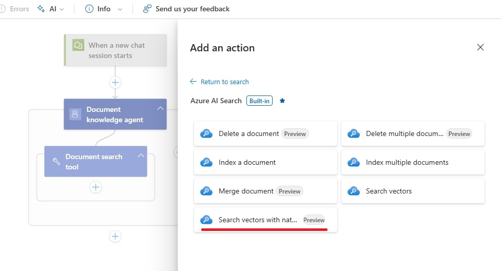
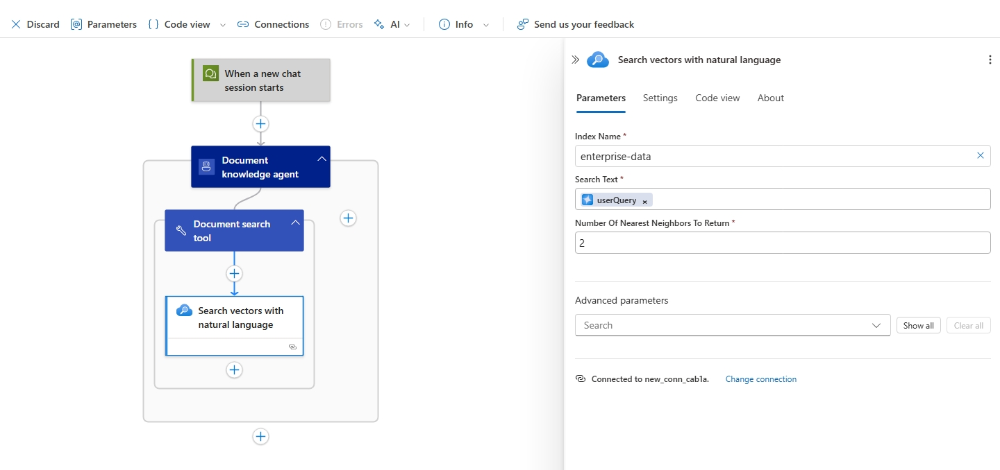
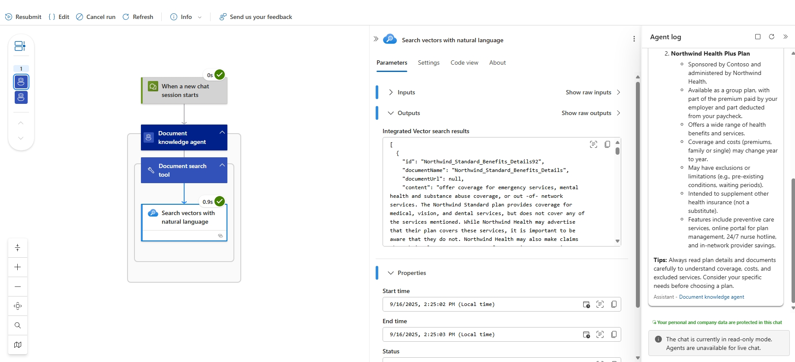

This module explains how to use advanced techniques to add custom knowledge to your Azure Logic Apps agents using RAG ingestion and retrieval. This module builds from module 4's agent implementation to create a simpler retrieval workflow using a search index with an integrated vectorizer.

When finished with this module, you'll have gained the following knowledge:

- **Azure AI Search integrated vectorization**: How to use Azure AI Search's integrated vectorization for RAG retrieval workflows, simplifying the workflow design.

## Part 1 - Data ingestion and Indexing
> :::note
> Prerequisites for this module are the following
> - You have access to an Azure Storage Account resource. For steps on setting this resource up, follow the guide here [Create an Azure storage account](https://learn.microsoft.com/en-us/azure/storage/common/storage-account-create?tabs=azure-portal).
>- You have a upload a pdf document to your storage resource. The link to this resource will be used in the next steps. The pdf used in this module can be download here [Benefit_Options.pdf](media/03-add-knowledge-to-agent/Benefit_Options.pdf) 
> - You have access to an Open AI Service and this service has a deployed model for generating text embeddings. For more on creating this service visit [Explore Azure OpenAI in Azure AI Foundry](https://learn.microsoft.com/en-us/azure/ai-foundry/openai/tutorials/embeddings?source=recommendations&tabs=command-line%2Cpython-new&pivots=programming-language-python).
> - You have access to an Azure AI Search service. For more on creating this resource visit here [Create an Azure AI Search service](https://learn.microsoft.com/en-us/azure/search/tutorial-optimize-indexing-push-api#create-an-azure-ai-search-service). Additionally, this module assumes your search index is created using this index schema: [index_schema](media/05-extend-knowledge-to-agent-using-ai-search-integrated-vectorization/integrated_vectorizer_schema.json)
>  - Be sure to supply your own OpenAI resource values for the following: {OpenAI resource URI}, {deployment ID}, {API key}, and { model name }.

### Part 1 - Create our data ingestion workflow
Refer to [Module 4](https://azure.github.io/logicapps-labs/docs/logicapps-ai-course/agent_functionality/extend-knowledge-to-agent#step-1---create-our-data-ingestion-worflow) - Step 1 for creating your ingestion workflow.

### Part 2 - Create your knowledge agent
To simplify the retrieval workflow compared to module 4, you will use the **Azure AI Search natural language** action in your workflow. This action will automatically engage the integrated vectorizer for generating embeddings. Because the search service creates embeddings for the incoming user queries, your Logic App will not need a separate action to generate embeddings.

#### Benefits
- Fewer actions in your Logic App (simpler workflows)
- Reduced API calls and maintenance
- Consistent vectorization when the same model is used for indexing and querying

#### Step 1 - Create your retrieval workflow
1. In the [Azure portal](https://portal.azure.com), open your Standard logic app resource.

1. Find and open your conversational agent workflow in the designer.


On the designer, select the agent action. Rename the agent: **Document knowledge agent**. Next enter the System Instructions  
```
You are a helpful assistant, answering questions about specific documents. When a question is asked, follow these steps in order: 

Use this tool to do a vector search of the user's question, the output of the vector search tool will have the related information to answer the question. Use the "content" field to generate an answer. Use only information to answer the user's question. No other data or information should be used to answer the question.
```
1. On the designer, inside the agent, select the plus sign (+) under **Add tool**.
1. Click on the Tool, and rename it to **Document search tool**. Then add the follow Description **Searches an azure search index for content related to the input question.**
1. Click the plus **(+)** sign to add a new action.
1. Search for **Azure AI Search (built-in)**.
1. Select the **Search vectors with natural language** action.

   - Set **Index Name** to the name of your index.
   - Set **Search Text** to the agent parameter previous created named **userQuery**.
   - Click **Save** on the Designer's top menu.
   
1. Test your workflow
   - Click on **Chat** from the left side menu.
   - Submit the question **What health plans are available?**.
   
1. Verify workflow execution
   - Click on **Run history** from the left side menu.
   - Click on the latest run and verify the agents execution.
   


#### Notes and considerations
- Use the same embedding model/deployment for both indexing and query vectorization to ensure compatible vectors.
- Verify quota, permissions, and cost implications for the configured embedding deployment.
- Keep monitoring and adjust the number of nearest neighbors and scoring parameters to tune relevance.
