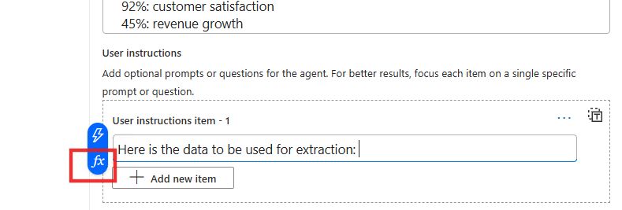
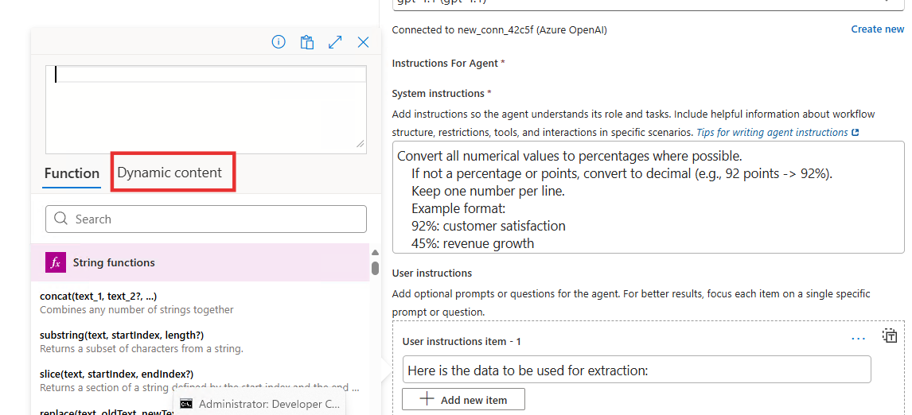
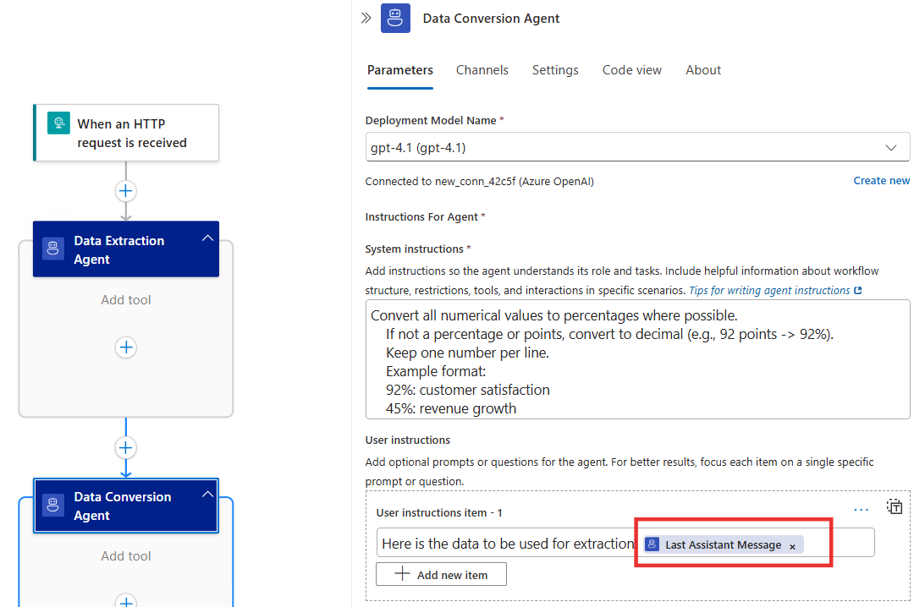

# Prompt Chaining Pattern (Module 02)

In this module, you learn how to implement the prompt chaining pattern in Azure Logic Apps. This pattern decomposes complex tasks into a sequence of steps, where each agent call processes the output of the previous one, trading latency for higher accuracy.

When you finish this module, you'll achieve the goals and complete the tasks in the following list:

• Understand when and why to use prompt chaining
• Build sequential agent workflows in Logic Apps
• Add validation gates between chain steps
• Handle errors and implement recovery mechanisms
• Monitor and optimize chain execution performance

## What is Prompt Chaining?

Prompt chaining is a workflow pattern that breaks down complex tasks into sequential steps, where each step is handled by a focused agent call. As described by Anthropic, this pattern "decomposes a task into a sequence of steps, where each LLM call processes the output of the previous one."

### Key Benefits

- **Higher Accuracy**: Each agent focuses on a single, well-defined task
- **Validation Gates**: Programmatic checks can be added between steps  
- **Debugging**: Easy to identify where issues occur in the chain
- **Modularity**: Individual steps can be optimized independently
- **Quality Control**: Built-in checkpoints for quality assurance

### When to Use This Pattern

Use prompt chaining when:
- Tasks can be cleanly decomposed into fixed subtasks
- Each step benefits from focused attention
- Quality is more important than speed
- You need validation gates between steps
- Complex tasks require sequential processing

## Example Scenario

We'll build a **business report processing chain** that transforms raw performance data into a formatted executive summary. This example is based on patterns from the Anthropic cookbook but adapted for Logic Apps.

**Input**: Raw quarterly performance text
**Chain Steps**:
1. **Extract**: Identify numerical values and metrics
2. **Format**: Convert to structured format
3. **Sorting**: Sort the data in descending order

**Output**: sorted extracted data in descending order

## Prerequisites

• An Azure account and subscription. If you don't have a subscription, [sign up for a free Azure account](https://azure.microsoft.com/free/?WT.mc_id=A261C142F).
• A Standard logic app resource with agent capabilities enabled.
• Completion of previous modules in the conversational agents series.

If you don't have this setup, see [Module 1 - Create your first conversational agent](../02_build_conversational_agents/01-create-first-conversational-agent.md).

## Part 1 - Build a Basic Prompt Chain

In this section, you'll create a three-step prompt chaining workflow that receives the business performance data in a http request and processes it sequentially before responding back with the processed data. 

### Step 1 - Create the workflow

1. Set up your agent
In the Azure portal, open your Standard logic app resource.

Add a new autonomous agent workflow in the designer.

 <iframe width="560" height="315" src="https://www.youtube.com/embed/YNIaHONnWX8?si=ExFsWGR9yGGqUP6J" title="Adding a new autonomous agent workflow." frameborder="0" allow="accelerometer; autoplay; clipboard-write; encrypted-media; gyroscope; picture-in-picture; web-share" referrerpolicy="strict-origin-when-cross-origin" allowfullscreen></iframe>

### Step 2 - Add the first agent (Data Extractor)

1. Configure the agent with the following settings:
   - **Name**: Data Extractor Agent
   - **System Instructions**: 
     ```
     Extract only the numerical values and their associated metrics from the text.
      Format each as 'value: metric' on a new line.
      Example format:
      92: customer satisfaction
      45%: revenue growth
     ```
   - **User Instructions**: 
     ```
     The following is the data that is to be used for extraction: @{triggerBody()?['report']}
     ```

### Step 3 - Add the second agent (Data Conversion)

1. Connect this agent to receive output from the Data Extractor
2. Configure the agent with these settings:
   - **Name**: Data Conversion Agent  
   - **System Instructions**:
     ```
     Convert all numerical values to percentages where possible.
      If not a percentage or points, convert to decimal (e.g., 92 points -> 92%).
      Keep one number per line.
      Example format:
      92%: customer satisfaction
      45%: revenue growth
     ```
   - **User Instructions**: 
     ```
     Here is the data to be used for extraction: @{outputs('Data_Extraction_Agent')?['lastAssistantMessage']}
     ```
   >:::caution
   >
   >The expression `@{outputs('Data_Extraction_Agent')?['lastAssistantMessage']}` inserts the last assistant message from 'Data_Extraction_Agent' into the content of the user instruction for the 'Data_Conversion_Agent'

    you can access it from the dynakic content tab in the function editor in Logic Apps desginer by:
    - First clicking on the place in the **User instructions** inputs field
    - Then Selecting the **Function Editor**
          

    - Click the **Dynamic Content** tab in the Function Editor
           
          
    - Click the **Last Assistant Message** under **Data Extraction Agent** from the dynamic content to insert the outputs from the previous agent to be part of the **User Instructions** of **Data Conversion Agent**
               

   Completed data conversion agent:

    

### Step 4 - Add the third agent (Data Sorting)

1. Connect this agent to receive the formatted table from the Data Converter
2. Configure the agent with these settings:
   - **Name**: Data Sorting Agent
   - **System Instructions**:
     ```
     Sort all lines in descending order by numerical value.
       Keep the format 'value: metric' on each line.
       Example:
       92%: customer satisfaction
       87%: employee satisfaction
     ```
   - **User Instructions**: 
     ```
     Here is the data for sorting: @{outputs('Data_Conversion_Agent')?['lastAssistantMessage']}
     ```
>:::caution
>
>   The expression `@{outputs('Data_Conversion_Agent')?['lastAssistantMessage']}` inserts the last assistant message from 'Data_Extraction_Agent' into the content of the user instruction for the 'Data_Sorting_Agent'

 A video showing the steps involved in creating the prompt chaining agent:
<iframe width="560" height="315" src="https://www.youtube.com/embed/m6sbZIJGd4I?si=hMUdxpdL8Vg1K-Zv" title="Create prompt chaining agent" frameborder="0" allow="accelerometer; autoplay; clipboard-write; encrypted-media; gyroscope; picture-in-picture; web-share" referrerpolicy="strict-origin-when-cross-origin" allowfullscreen></iframe>


### Step 5 - Test the prompt chain

1. Use "Run With Payload" button to send this sample input data as the report to process:
   ```
   {
    "report": "Q3 Performance Summary:
            Our customer satisfaction score rose to 92 points this quarter.
            Revenue grew by 45% compared to last year.
            Market share is now at 23% in our primary market.
            Customer churn decreased to 5% from 8%.
            New user acquisition cost is $43 per user.
            Product adoption rate increased to 78%.
            Employee satisfaction is at 87 points.
            Operating margin improved to 34%."
   }
   ```


2. Expected output progression:
   - **Step 1**: Raw data → Extracted values and metrics
   - **Step 2**: Extracted data → Convert to the desired format
   - **Step 3**: Formatted table → Sorted data 

A video showing testing of prompt chaining agent:
<iframe width="560" height="315" src="https://www.youtube.com/embed/FywgmlwQqMM?si=a8OYT-wvRL6yUn7z" title="Run a prompt chaining agent" frameborder="0" allow="accelerometer; autoplay; clipboard-write; encrypted-media; gyroscope; picture-in-picture; web-share" referrerpolicy="strict-origin-when-cross-origin" allowfullscreen></iframe>

## Best Practices for Prompt Chaining

- **Keep steps focused**: Each agent should have a single, clear responsibility
- **Add validation gates**: Implement checks between steps to catch errors early
- **Design for recovery**: Plan how to handle failures at each step
- **Monitor performance**: Track execution time and success rates
- **Optimize prompts**: Refine agent instructions based on results
- **Test edge cases**: Validate behavior with unusual or malformed inputs

