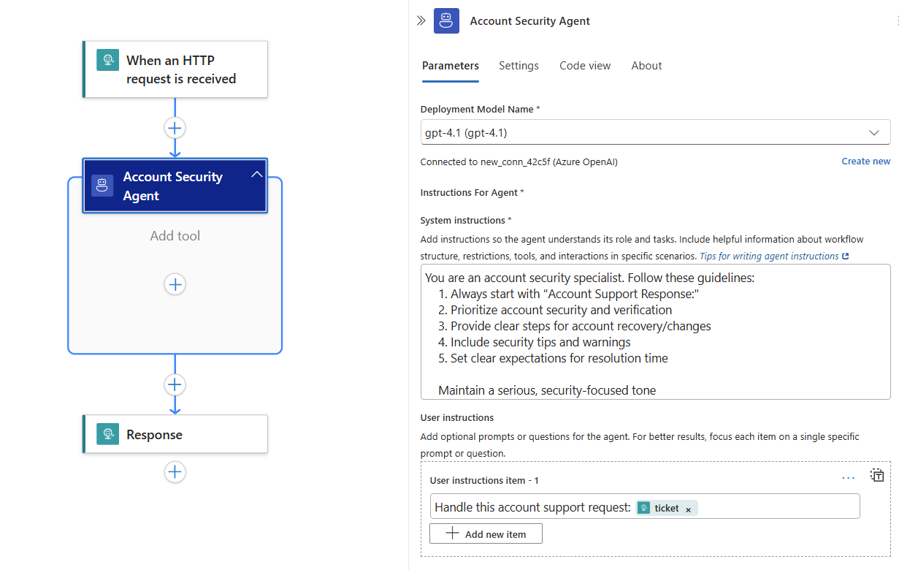
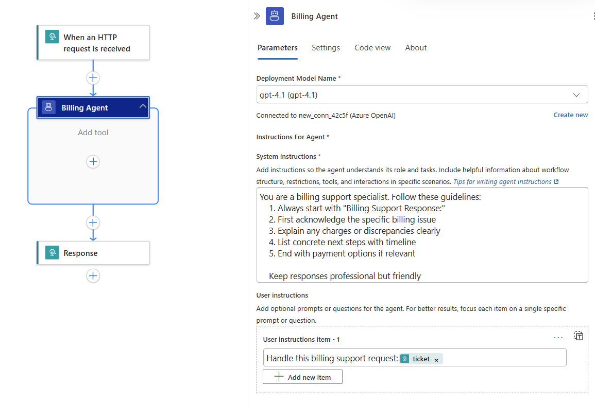
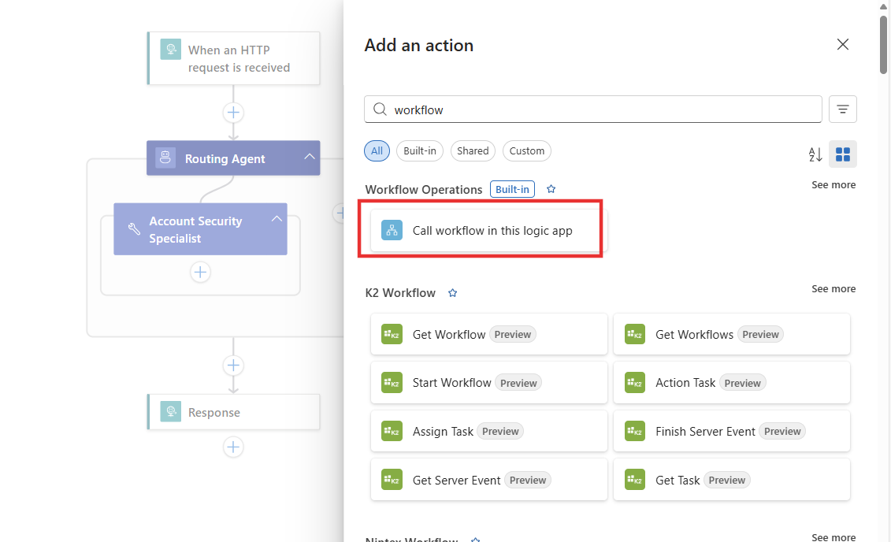
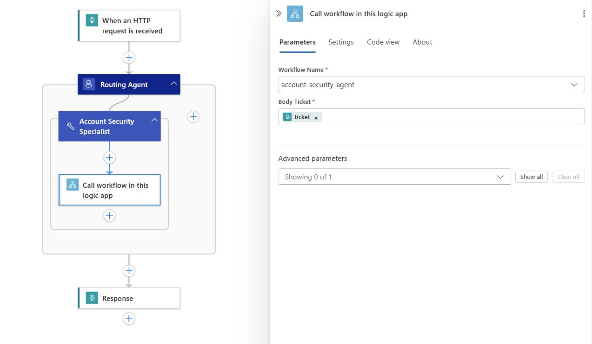
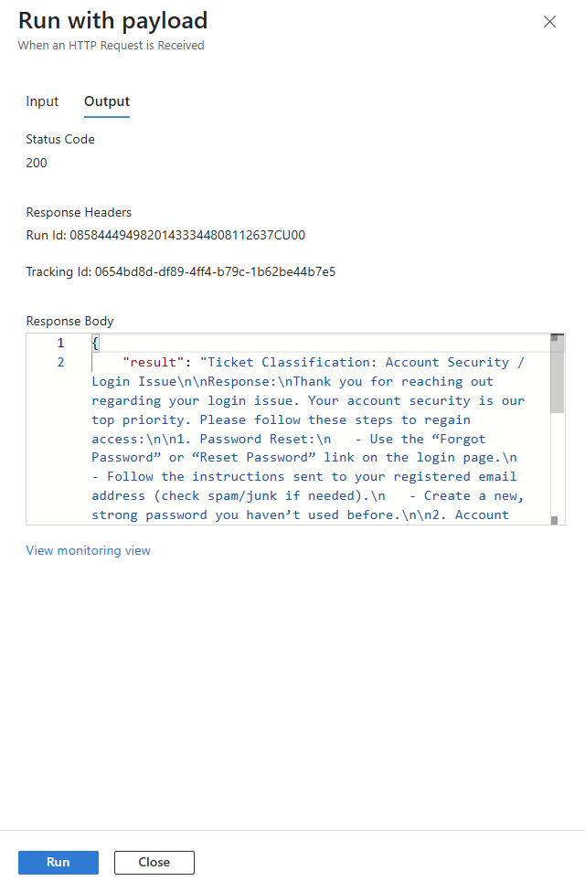
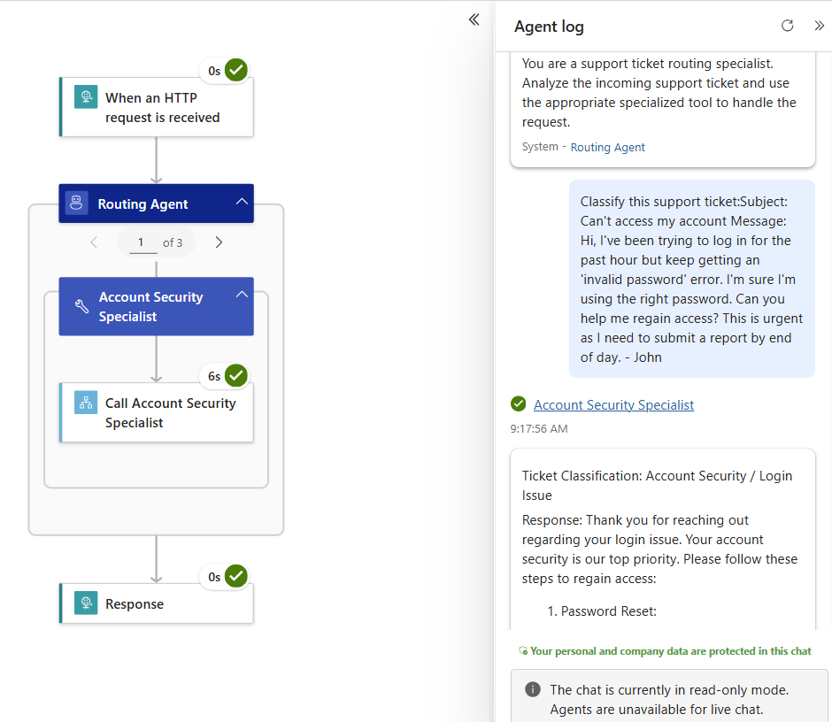

--- 
title: 04 - Implement the Routing pattern with Azure Logic Apps
description: Learn how to implement the routing pattern with Azure Logic Apps — classifying inputs and directing them to specialized workflows with confidence thresholds, fallbacks, and monitoring to ensure reliable, scalable processing.
ms.service: logic-apps
ms.topic: tutorial
ms.date: 09/02/2025
author: rohithah
ms.author: rohithah
---

In this module, you learn how to implement the routing pattern in Azure Logic Apps. This pattern dynamically classifies inputs and directs them to specialized agents based on content analysis, enabling optimized handling for different types of requests.

When you finish this module, you'll achieve the goals and complete the tasks in the following list:

• Understand when and why to use routing
• Build classification logic for input routing
• Create specialized agents for different routes
• Implement fallback mechanisms for edge cases
• Handle routing confidence and validation
• Monitor and optimize routing accuracy

## What is Routing?

Routing is a workflow pattern that classifies inputs and directs them to specialized agents based on content characteristics. As described by Anthropic, this pattern "routes input to specialized prompt using content classification" to ensure each request gets handled by the most appropriate agent.

### Key Benefits

- **Separation of Concerns**: Different input types handled by specialized agents
- **Optimization**: Each route can be tuned for its specific input category  
- **Performance**: Specialized agents perform better than general-purpose ones
- **Scalability**: Easy to add new categories and specialized routes
- **Quality Control**: Better results through focused agent expertise

### When to Use This Pattern

Use routing when:
- You have distinct categories of inputs requiring different handling
- Classification can be handled accurately by an agent
- Specialized handling improves performance over a general approach
- You want to optimize different workflows independently
- Different input types need different response formats or expertise

## Example Scenario

We'll build a **customer support ticket routing system** that analyzes incoming support requests and routes them to appropriate specialized agent. This example is based on the Anthropic cookbook routing pattern but adapted for Logic Apps.

**Input**: Customer support ticket with subject and message
**Routing Logic**: Analyze content to determine appropriate team
**Specialized Routes**:
1. **Account Team**: Handle login, password, and account access issues
2. **Billing Team**: Process payment, subscription, and billing inquiries
3. **Technical Team**: Resolve product functionality and how-to questions
4. **Product Team**: Address feature requests and general product guidance

**Output**: Specialized response tailored to the specific issue type

## Prerequisites

• An Azure account and subscription. If you don't have a subscription, [sign up for a free Azure account](https://azure.microsoft.com/free/?WT.mc_id=A261C142F).
• A Standard logic app resource with agent capabilities enabled.
• Completion of previous modules in the conversational agents series.

If you don't have this setup, see [Module 1 - Create your first conversational agent](../02_build_conversational_agents/01-create-first-conversational-agent.md).

## Part 1 - Build Specialized Agent Workflows

In this section, you'll create five separate agent workflows: four specialized support agents and one routing agent that uses nested workflow actions to invoke the appropriate specialist based on ticket classification. We will implement each of these agents with a request trigger and a response action to return the result after the agent-loop action has completed.

### Step 1 - Create the Account Security Agent Workflow

1. Create a new workflow in your Logic Apps resource:
   - **Workflow Name**: `account-security-agent`
   - **Workflow Type**: Autonomous Agent

2. Add a request trigger and specify the request body JSON schema to have the following:
     ```
    {
        "type": "object",
        "properties": {
            "ticket": {
            "type": "string"
            }
        },
        "required":["ticket"]
    }
     ```
   This would allow the **routing agent** to invoke the **account security agent** with ticket details as an input parameter.

3. Configure the Account Security Agent:
   - **Name**: Account Security Agent  
   - **System Instructions**:
     ```
     You are an account security specialist. Follow these guidelines:
     1. Always start with "Account Support Response:"
     2. Prioritize account security and verification
     3. Provide clear steps for account recovery/changes
     4. Include security tips and warnings
     5. Set clear expectations for resolution time
     
     Maintain a serious, security-focused tone.
     ```
   - **User Instructions**: 
     ```
     Handle this account support request: @{triggerBody()?['ticket']}
     ```

4. Add a response action and have the following as the **body** of the response:
     ```
    {
         "result": "@outputs('Account_Security_Agent')?['lastAssistantMessage']"
    }
     ```
   This would allow the **account security agent** to return the agent-loop outputs as the result to the **routing agent** that invokes it.

  Screenshot showing the completed account security agent: 
   

### Step 2 - Create the Billing Support Agent Workflow

1. Create a new workflow in your Logic Apps resource:
   - **Workflow Name**: `billing-support-agent`
   - **Workflow Type**: Autonomous Agent

2. Add a request trigger and specify the request body JSON schema to have the following:
     ```
    {
        "type": "object",
        "properties": {
            "ticket": {
            "type": "string"
            }
        },
        "required":["ticket"]
    }
     ```
   This would allow the **routing agent** to invoke the **billing support agent** with ticket details as an input parameter.

3. Configure the Billing Support Agent:
   - **Name**: Billing Agent
   - **System Instructions**:
     ```
     You are a billing support specialist. Follow these guidelines:
     1. Always start with "Billing Support Response:"
     2. First acknowledge the specific billing issue
     3. Explain any charges or discrepancies clearly
     4. List concrete next steps with timeline
     5. End with payment options if relevant
     
     Keep responses professional but friendly.
     ```
   - **User Instructions**: 
     ```
     Handle this billing support request: @{triggerBody()?['ticket']}
     ```

4. Add a response action and have the following as the **body** of the response:
     ```
    {
         "result": "@{outputs('Billing_Agent')?['lastAssistantMessage']}"
    }
     ```
   This would allow the **billing agent** to return the agent-loop outputs as the result to the **routing agent** that invokes it.

  Screenshot showing the completed biling agent: 
   

### Step 3 - Create the Technical Support Agent Workflow

1. Create a new workflow in your Logic Apps resource:
   - **Workflow Name**: `tech-support-agent`
   - **Workflow Type**: Autonomous Agent

2. Add a request trigger and specify the request body JSON schema to have the following:
     ```
    {
        "type": "object",
        "properties": {
            "ticket": {
            "type": "string"
            }
        },
        "required":["ticket"]
    }
     ```
   This would allow the **routing agent** to invoke the **tech support agent** with ticket details as an input parameter.

3. Configure the Technical Support Agent:
   - **Name**: Tech Support Agent
   - **System Instructions**:
     ```
     You are a technical support engineer. Follow these guidelines:
     1. Always start with "Technical Support Response:"
     2. List exact steps to resolve the issue
     3. Include system requirements if relevant
     4. Provide workarounds for common problems
     5. End with escalation path if needed
     
     Use clear, numbered steps and technical details.
     ```
   - **User Instructions**: 
     ```
     Handle this technical support request: @{triggerBody()?['ticket']}
     ```

4. Add a response action and have the following as the **body** of the response:
     ```
    {
         "result": "@{outputs('Tech_Support_Agent')?['lastAssistantMessage']}"
    }
     ```
   This would allow the **tech support agent** to return the agent-loop outputs as the result to the **routing agent** that invokes it.

  Screenshot showing the completed technical support agent: 
   
### Step 4 - Create the Product Support Agent Workflow

1. Create a new workflow in your Logic Apps resource:
   - **Workflow Name**: `product-support-agent`
   - **Workflow Type**: Autonomous Agent

2. Add a request trigger and specify the request body JSON schema to have the following:
     ```
    {
        "type": "object",
        "properties": {
            "ticket": {
            "type": "string"
            }
        },
        "required":["ticket"]
    }
     ```
   This would allow the **routing agent** to invoke the **product support agent** with ticket details as an input parameter.

3. Configure the Product Support Agent:
   - **Name**: Product Support Agent
   - **System Instructions**:
     ```
     You are a product specialist. Follow these guidelines:
     1. Always start with "Product Support Response:"
     2. Focus on feature education and best practices
     3. Include specific examples of usage
     4. Link to relevant documentation sections
     5. Suggest related features that might help
     
     Be educational and encouraging in tone.
     ```
   - **User Instructions**: 
     ```
     Handle this product support request: @{triggerBody()?['ticket']}
     ```

4. Add a response action and have the following as the **body** of the response:
     ```
    {
         "result": "@{outputs('Product_Support_Agent')?['lastAssistantMessage']}"
    }
     ```
   This would allow the **product support agent** to return the agent-loop outputs as the result to the **routing agent** that invokes it.

  Screenshot showing the completed product support agent: 
   

### Step 5 - Create the Main Routing Agent Workflow

1. Create a new workflow in your Logic Apps resource:
   - **Workflow Name**: `routing-agent`
   - **Workflow Type**: Autonomous Agent

2. Add a request trigger and specify the request body JSON schema to have the following:
     ```
    {
        "type": "object",
        "properties": {
            "ticket": {
            "type": "string"
            }
        },
        "required":["ticket"]
    }
     ```
   This would allow the **routing agent** to receive ticket details as an input parameter.

3. Configure the Classification Router Agent:
   - **Name**: Routing Agent
   - **System Instructions**: 
     ```
     You are a support ticket routing specialist. Analyze the incoming support ticket and use the appropriate specialized tool to handle the request.
     ```

   - **User Instructions**: 
     ```
     Handle this support ticket: @{triggerBody()?['ticket']}
     ```
   :::note
   The router agent will automatically analyze the ticket and invoke the appropriate specialized workflow tool based on the ticket content, eliminating the need for manual routing logic.

4. Configure the router agent to use the specialized workflows as tools by adding workflow actions as tools:

   **Account Support Tool**:
   - **Tool Name**: `Account Security Specialist`
   - **Tool Description**: `Handle account-related issues like login, password, and account security problems`
   - **Workflow Action**: `account-security-agent`

      
   - **Input Parameters**: 
     ```json
     {
      "ticket": "@triggerBody()?['ticket']"
     }
     ```
     

   **Billing Support Tool**:
   - **Tool Name**: `Billing Support`
   - **Tool Description**: `Handle billing-related issues like payments, subscriptions, and pricing inquiries`
   - **Workflow Action**: `billing-agent`
   - **Input Parameters**: 
     ```json
     {
       "ticket": "@triggerBody()?['ticket']"
     }
     ```

   **Technical Support Tool**:
   - **Tool Name**: `Tech Support`
   - **Tool Description**: `Handle technical issues like product functionality and how-to questions`
   - **Workflow Action**: `tech-support-agent`
   - **Input Parameters**: 
     ```json
     {
       "ticket": "@triggerBody()?['ticket']"
     }
     ```

   **Product Support Tool**:
   - **Tool Name**: `Product Specialist`
   - **Tool Description**: `Handle product-related questions like feature requests and general guidance`
   - **Workflow Action**: `product-specialist-agent`
   - **Input Parameters**: 
     ```json
     {
       "ticket": "@triggerBody()?['ticket']"
     }
     ```
5. Add a **Response** action after the router agent to return the specialized agent's response
and configure the response body to return the router agent's output, which will include the result from whichever specialized workflow tool was called:
   ```json
   {
     "result": "@{outputs('Routing_Agent')?['lastAssistantMessage']}"
   }
   ```

   [!NOTE] Since the router agent uses the specialized workflows as tools, the agent's response will automatically contain the output from the appropriate specialized workflow that was invoked.

Screenshot showing the completed routing agent: 
 

### Step 6 - Test the routing workflow

1. Test the main routing workflow (`routing-agent`) with different types of support tickets:

   **Account Issue Example**:
   ```json
   {
     "ticket": "Subject: Can't access my account\nMessage: Hi, I've been trying to log in for the past hour but keep getting an 'invalid password' error. I'm sure I'm using the right password. Can you help me regain access? This is urgent as I need to submit a report by end of day.\n- John"
   }
   ```
    
    

   **Billing Issue Example**:
   ```json
   {
     "ticket": "Subject: Unexpected charge on my card\nMessage: Hello, I just noticed a charge of $49.99 on my credit card from your company, but I thought I was on the $29.99 plan. Can you explain this charge and adjust it if it's a mistake?\nThanks,\nSarah"
   }
   ```

   **Technical Issue Example**:
   ```json
   {
     "ticket": "Subject: How to export data?\nMessage: I need to export all my project data to Excel. I've looked through the docs but can't figure out how to do a bulk export. Is this possible? If so, could you walk me through the steps?\nBest regards,\nMike"
   }
   ```

2. Expected routing behavior:
   - **Account ticket**: Router agent analyzes ticket → Automatically calls `account_support` tool → Returns specialized response
   - **Billing ticket**: Router agent analyzes ticket → Automatically calls `billing_support` tool → Returns specialized response  
   - **Technical ticket**: Router agent analyzes ticket → Automatically calls `technical_support` tool → Returns specialized response
   - **Product ticket**: Router agent analyzes ticket → Automatically calls `product_support` tool → Returns specialized response

Screenshot showing the run history for tesing for routing agent: 
 

3. Verify the flow:
   - Router agent analyzes ticket content and determines the most appropriate tool to use
   - Agent automatically invokes the corresponding specialized workflow tool
   - Specialized workflow processes the ticket and returns domain-specific response
   - Router agent includes the tool's response in its final output
   - Main workflow returns the complete response to the caller
