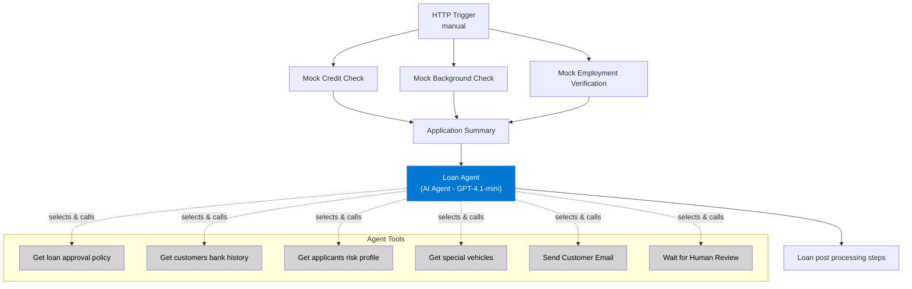
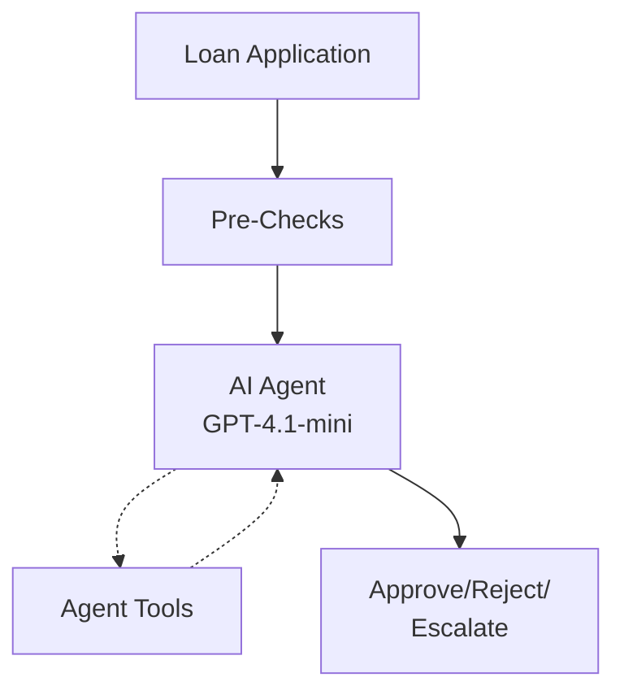
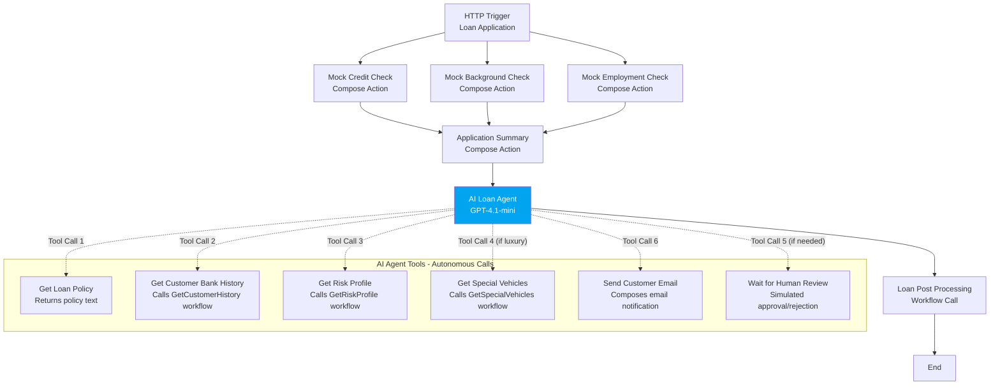

# AI Loan Agent Sample

This sample demonstrates how to build an AI agent in Azure Logic Apps Standard that autonomously analyzes loan applications, selects verification tools, and determines approval decisions.

- **[Deploy](#deploy-sample)** with one click using built-in test scenarios
- **[Explore](#explore-sample)** agent behaviors across approval, rejection, and escalation cases
- **[Extend](#extending-the-sample)** with Teams, email, and service integrations



**Key Concept:** The AI agent in the LoanApprovalAgent workflow autonomously decides which tools to call, in what order, and when to stop.

*See [Architecture](#architecture) section for detailed technical information.*

**What you'll learn:**
- **Deploy AI agent workflows** - One-click deployment of Logic Apps with Azure OpenAI integration
- **Explore agent behaviors** - Test autonomous decision-making across approval, rejection, and escalation scenarios
- **Extend with connectors** - Replace mock services with Teams Adaptive Cards, Office 365, and other integrations

**[Watch Demo Video](https://youtu.be/rR1QjQTfCCg)** | **[Agent Workflow Blog](https://techcommunity.microsoft.com/blog/integrationsonazureblog/%F0%9F%A4%96-agent-loop-demos-%F0%9F%A4%96/4414770)**

---

## Deploy Sample

### Prerequisites

Before deploying this sample, ensure you have:

- **Azure subscription** - With contributor access to create resources

**What gets deployed:** The Deploy to Azure button provisions all required resources, configures RBAC permissions, and deploys agent workflows with built-in test scenarios. No local tools, API keys, or external service configuration required.

| Resource | Purpose |
|----------|----------|
| **Logic App Standard** | Hosts AI agent workflows with autonomous decision-making capabilities |
| **Azure OpenAI** | Provides GPT-4.1-mini model for agent reasoning. Selected for cost efficiency, low latency, and multi-step tool selection in this agent workflow |
| **Storage Account** | Stores workflow state, run history, and runtime data |
| **App Service Plan** | Provides compute resources for Logic App hosting |
| **Managed Identity** | Enables passwordless authentication (System-Assigned → OpenAI access, User-Assigned → Storage & deployment automation) |

**Note:** This sample includes **pre-configured test scenarios** with built-in data sources for credit checks, employment verification, and banking history. This eliminates external service dependencies required to deploy and explore the sample. See [Extending the Sample](#extending-the-sample) to replace with service integrations.

---

### Deploy to Azure

Click the button below to deploy this sample to your Azure subscription:

[](https://portal.azure.com/#create/Microsoft.Template/uri/https%3A%2F%2Fraw.githubusercontent.com%2Fmodularity%2Flogicapps-labs%2Frefs%2Fheads%2Floan-agent-deployment%2Fsamples%2Fai-loan-agent-sample%2F1ClickDeploy%2Fsample-arm.json)

**What happens when you click:**
1. Opens Azure Portal in your browser and prompts for:
   - Subscription
   - Resource Group (create new recommended: `rg-ailoan`)
   - Region (must support both Azure OpenAI GPT-4.1-mini and Logic Apps Standard - see [Region Selection](#region-selection))
   - Project Name (default: `ailoan`)
2. Provisions Azure resources
3. Configures RBAC permissions
4. Deploys Logic Apps workflows

**After deployment completes:**
- Navigate to your resource group to see all resources
- Find the Logic App resource: `{projectName}-logicapp`
- Deployment completes successfully - all resources are provisioned and agent workflows are deployed
- You're ready to explore the agent workflow. See [Test the AI Agent](#test-the-ai-agent) below.

---

**Deployment time:** Approximately 5-10 minutes.

**Having issues?** See the [Troubleshoot](#troubleshoot) section for solutions to common deployment problems.

**Clean up:** When finished, delete the resource group from Azure Portal to remove all resources.

<details>
<summary><b>Resource Naming Conventions</b></summary>

All resources use your `ProjectName` as the base, with different patterns depending on whether they require global uniqueness:

**Pattern Overview:**
- **Subscription-scoped resources** (Resource Group, Managed Identity, Azure OpenAI): Use `{projectName}` only
- **Globally-scoped resources** (Logic App, App Service Plan, Storage): Add a random `{uniqueId}` to prevent naming collisions across all Azure deployments worldwide

| Resource | Naming Pattern | Example (ProjectName = "ailoan") |
|----------|----------------|----------------------------------|
| Resource Group | `rg-{projectName}` | `rg-ailoan` |
| Managed Identity | `{projectName}-managedidentity` | `ailoan-managedidentity` |
| Azure OpenAI | `{projectName}-openai` | `ailoan-openai` |
| Logic App | `{projectName}{uniqueId}-logicapp` | `ailoanxyz123abc-logicapp` |
| App Service Plan | `{projectName}{uniqueId}-plan` | `ailoanxyz123abc-plan` |
| Storage Account | `{projectName}{uniqueId}` (no hyphens) | `ailoanxyz123abc` |

**Note:** The `{uniqueId}` is a 12-character random string (e.g., `xyz123abc`) automatically generated during deployment to ensure globally unique names.

</details>

<details id="region-selection">
<summary><b>Region Selection</b></summary>

The deployment requires a region that supports both GPT-4.1-mini in Azure OpenAI and Azure Logic Apps Standard.

**Recommended regions:** East US 2, West Europe, Italy North, Australia East

For the complete list of regional availability:
- [Azure OpenAI model availability by region](https://learn.microsoft.com/azure/ai-services/openai/concepts/models#model-summary-table-and-region-availability)
- [Azure Logic Apps Standard availability](https://azure.microsoft.com/en-us/explore/global-infrastructure/products-by-region/table) (search for "Logic Apps")

</details>

---

## Explore Sample

Now that your sample is deployed, let's explore how the AI agent makes loan decisions. You'll manually test the workflow with four different scenarios using the Azure Portal.

### Access Your Workflow

1. Navigate to [Azure Portal](https://portal.azure.com)
2. Go to your resource group (e.g., `rg-ailoan`)
3. Open your Logic App resource (e.g., `ailoan-logicapp`)
4. In the left menu: **Workflows** → Click **LoanApprovalAgent**
5. Click **Designer** in the left sidebar to open the workflow designer

[TODO: Screenshot showing workflow designer navigation]

### Test the AI Agent

You'll test 4 scenarios that demonstrate different agent behaviors: auto-approval, edge cases, auto-rejection, and human review escalation.

#### How to Run Each Test:

1. In the workflow designer, click **Run** → **Run with payload** (top toolbar)
2. Copy-paste the test payload below into the **Body** field
3. Click **Run**
4. You should see a **202 Accepted** status in the Output
5. Click **Run history** in the left sidebar under **Tools** section
6. The **Run history** tab shows recent runs - click the most recent **Identifier** to open details
7. Review the **Agent log** and individual action inputs/outputs

<details>
<summary><b>Test 1: Auto-Approval</b></summary>

**Scenario:** Strong applicant meeting all auto-approval criteria

**Payload:**
```json
{
  "applicationId": "APP-AUTO-APPROVE-001",
  "name": "Applicant A",
  "email": "applicant.a@example.com",
  "loanAmount": 25000,
  "vehicleMake": "Toyota",
  "vehicleModel": "Camry",
  "salary": 75000,
  "employmentYears": 5
}
```

**Expected Behavior:**
- Credit score: 780 (excellent) - from built-in test data
- Loan amount: $25K (under $50K threshold)
- Employment: 5 years (stable, ≥2 years required)
- No bankruptcy history
- Result: **Auto-approved without human review**

**What to Observe:**
1. **Duration:** Typically 10-30 seconds
2. **Agent Log:** 
   - Agent calls "Get loan approval policy" first to understand rules
   - Calls "Get customers bank history" to verify banking relationship
   - Calls "Get applicants risk profile" to calculate debt-to-income ratio
   - Sends customer email with approval decision
   - No "Wait for Human Review" tool called (policy criteria met)
3. **Workflow Actions:** Click through the Loan Agent action iterations to see each tool execution
4. **Policy Match:** Agent identifies this meets auto-approval policy: Credit≥700, Loan≤$50K, Employment≥2yr, No bankruptcy

[TODO: Screenshot showing agent log with tool execution sequence for auto-approval]

</details>

<details>
<summary><b>Test 2: Edge Case - High Loan with Strong Profile</b></summary>

**Scenario:** Loan exceeds threshold but strong compensating factors present

**Payload:**
```json
{
  "applicationId": "APP-REVIEW-REQUIRED-002",
  "name": "Applicant B",
  "email": "applicant.b@example.com",
  "loanAmount": 55000,
  "vehicleMake": "BMW",
  "vehicleModel": "X5",
  "salary": 95000,
  "employmentYears": 3
}
```

**Expected Behavior:**
- Credit score: 720 (good)
- Loan amount: $55K (exceeds $50K threshold → typically requires human review)
- High income: $95K (strong compensating factor)
- Solid employment: 3 years
- Result: **Agent evaluates trade-offs and makes autonomous decision**

**What to Observe:**
1. **Agent Reasoning:** How does the agent balance loan amount exceeding threshold vs. strong credit/income?
2. **Policy Application:** Policy states loans >$50K require human review, but agent may consider compensating factors
3. **Risk Profile:** Check the "Get applicants risk profile" tool output - debt-to-income ratio should be favorable
4. **Decision Logic:** Agent demonstrates autonomous judgment on ambiguous cases not explicitly covered by strict policy rules

This test shows the agent's ability to handle edge cases with nuanced decision-making.

</details>

<details>
<summary><b>Test 3: Auto-Rejection</b></summary>

**Scenario:** Clear policy violations trigger immediate rejection

**Payload:**
```json
{
  "applicationId": "APP-AUTO-REJECT-003",
  "name": "Applicant C",
  "email": "applicant.c@example.com",
  "loanAmount": 30000,
  "vehicleMake": "Honda",
  "vehicleModel": "Accord",
  "salary": 45000,
  "employmentYears": 0.5
}
```

**Expected Behavior:**
- Credit score: 580 (below 600 threshold) - from built-in test data
- Bankruptcy: 1 (policy violation)
- Employment: 0.5 years (below 1 year minimum)
- Result: **Auto-rejected without extensive verification**

**What to Observe:**
1. **Efficient Processing:** Agent recognizes policy violation early (Credit<600 with bankruptcy)
2. **Minimal Tool Calls:** Agent may skip detailed verification tools (bank history, risk profile) since rejection is clear
3. **Fast Execution:** Should complete faster than approval scenarios
4. **Rejection Reasoning:** Check agent's explanation - should cite specific policy violations

This demonstrates the agent's efficiency in handling clear-cut rejections without unnecessary processing.

</details>

<details>
<summary><b>Test 4: Human Review Required</b></summary>

**Scenario:** Luxury vehicle triggers mandatory human review

**Payload:**
```json
{
  "applicationId": "APP-LUXURY-REVIEW-004",
  "name": "Applicant D",
  "email": "applicant.d@example.com",
  "loanAmount": 80000,
  "vehicleMake": "Ferrari",
  "vehicleModel": "F8 Tributo",
  "salary": 120000,
  "employmentYears": 4
}
```

**Expected Behavior:**
- Credit score: 750 (excellent)
- Vehicle: Ferrari F8 Tributo (luxury/special vehicle)
- High loan amount: $80K
- Strong income: $120K
- Result: **Escalated to human review despite strong financials**

**What to Observe:**
1. **Special Vehicle Detection:** Agent calls "Get special vehicles" tool to check if Ferrari is in luxury vehicle database
2. **Human Review Tool:** Agent calls "Wait for Human Review" tool (currently built-in approval logic)
3. **Complete Verification:** Agent performs full verification (policy, bank history, risk profile) before escalation
4. **Policy Override:** Even with excellent credit/income, luxury vehicle policy requires human approval

This shows how the agent handles mandatory escalation scenarios. In production, this would integrate with Microsoft Teams Adaptive Cards for real human approval. See [Extending the Sample](#extending-the-sample) to implement Teams integration.

[TODO: Screenshot showing Wait for Human Review tool execution in agent log]

</details>

---

**Having issues?** See the [Troubleshoot](#troubleshoot) section for solutions to testing and runtime problems.

---

### Next Steps

Ready to make this sample production-ready? See [Extending the Sample](#extending-the-sample) to:
- Replace mock human approval with Microsoft Teams Adaptive Cards
- Integrate real credit check APIs
- Connect to actual banking systems
- Add email notifications via Office 365

---

## Extending the Sample

This sample uses built-in test scenarios and pre-configured data sources to demonstrate AI agent capabilities without external dependencies. To use it with production applications, replace these built-in components with service integrations.

### Add Human-in-the-Loop with Teams

Replace the built-in approval logic with Microsoft Teams Adaptive Cards. When the agent escalates a loan application, it posts an interactive card to your Teams channel where approvers can review details and make decisions.

**[→ Follow the Teams Integration Guide](TEAMS-CONNECTOR.md)**

### Other Integration Options

Beyond human review, you might replace these built-in components with:

| Component | Current Implementation | Integration Options |
|-----------|--------------|---------------------|
| **Human Review** | Conditional approval logic | Microsoft Teams Adaptive Cards |
| Email Notifications | Notification templates | Office 365 Outlook, SendGrid, Azure Communication Services |
| Credit Checks | Pre-configured test scores | Experian, TransUnion, Equifax APIs |
| Background Checks | Built-in test data | Checkr, GoodHire APIs |
| Banking History | Scenario-based data | SQL Database, Cosmos DB, Banking APIs |
| Vehicle Database | Static reference list | Kelly Blue Book, NADA, Edmunds APIs |

### Customize Workflows

To modify the workflow logic:
- **Azure Portal:** [Edit workflows in the Azure portal](https://learn.microsoft.com/azure/logic-apps/create-single-tenant-workflows-azure-portal)
- **VS Code:** See [`LogicApps/README.md`](LogicApps/README.md) for local development setup

---

## Troubleshoot

<details>
<summary><b>Deployment</b></summary>

**Wrong tenant or subscription selected:**
- The Deploy button opens your default Azure tenant and subscription
- To switch: Click your profile icon (top right) → **Switch directory** → Select the correct tenant
- To change subscription: After selecting tenant, choose the correct subscription from the dropdown
- [Learn more about switching directories](https://learn.microsoft.com/azure/azure-portal/set-preferences#switch-and-manage-directories)

**Deployment fails with resource name conflict:**
```
Please pick a different name. The subdomain name 'projectname-openai' is not available 
as it's already used by a resource. (Code: CustomDomainInUse)
```
- The Azure OpenAI resource name is already in use (either by another deployment or a recently deleted resource)
- Solution: Use a different Project Name parameter during deployment
- Note: Recently deleted Azure OpenAI resources remain reserved for up to 48 hours before the name becomes available
- [Learn more about purging deleted resources](https://learn.microsoft.com/azure/ai-services/recover-purge-resources)

**Deployment fails with Azure OpenAI quota error:**
```
This operation requires 50 new capacity in quota Tokens Per Minute (thousands) - 4.1-mini - 
GlobalStandard, which is bigger than the current available capacity. (Code: InsufficientQuota)
```
- Your subscription has insufficient Azure OpenAI quota for the GPT-4.1-mini model
- Solution 1: Try a different region where you may have available quota
- Solution 2: Request a quota increase through Azure Portal → Azure OpenAI resource → Quotas
- [Learn more about Azure OpenAI quota management](https://learn.microsoft.com/azure/ai-services/openai/how-to/quota)

**Deployment fails with Logic Apps quota error:**
```
Operation cannot be completed without additional quota.
Current Limit (WorkflowStandard VMs): 0
```
- Logic Apps Standard quota exceeded in selected region
- Solution: Choose a different region from the [supported regions list](#region-selection)
- Or request a quota increase for Logic Apps Standard in your subscription

**Deployment hangs or times out:**
- DeploymentScripts resource may be running (provisions workflows + RBAC)
- Allow up to 15 minutes
- [View the Activity Log](https://learn.microsoft.com/azure/azure-monitor/essentials/activity-log?tabs=portal#view-and-retrieve-the-activity-log) for details
- If stuck beyond 15 minutes, [view deployment history and redeploy](https://learn.microsoft.com/azure/azure-resource-manager/templates/deployment-history?tabs=azure-portal#resource-group-deployments): Go to your resource group → **Deployments** (left menu) → Select the deployment → Click **Redeploy** button

**Missing resources after deployment:**
- Verify all 5 resources are present: Logic App, OpenAI, Storage, App Service Plan, Managed Identity
- [View deployment outputs](https://learn.microsoft.com/azure/azure-resource-manager/templates/deployment-history?tabs=azure-portal#resource-group-deployments) for error messages
- Ensure you have Contributor role on subscription/resource group

</details>

<details>
<summary><b>Runtime</b></summary>

**Workflow fails with "Unauthorized" error:**
- RBAC permissions may not have propagated yet
- Wait 2-3 minutes and run workflow again
- [Assign role-based access to Managed Identity](https://learn.microsoft.com/azure/logic-apps/authenticate-with-managed-identity?tabs=standard#assign-role-based-access-to-a-managed-identity-using-the-azure-portal):
  - System-Assigned Identity → OpenAI: "Cognitive Services OpenAI User"
  - User-Assigned Identity → Storage: "Storage Blob Data Owner", "Storage Queue Data Contributor", "Storage Table Data Contributor"

**Workflow runs but no results:**
- [Review run history](https://learn.microsoft.com/azure/logic-apps/view-workflow-status-run-history?tabs=standard#review-run-history) for specific action failures
- Review Agent log for tool execution errors: Open workflow run → Expand **Agent loop** action → View **Agent log** output
- Verify Azure OpenAI model deployment is active (gpt-4.1-mini)

**Agent makes unexpected decisions:**
- Review Agent log to see tool execution order
- Check system instructions in agent configuration
- Verify tool descriptions are clear and accurate
- See [Optimize Agent Performance](https://learn.microsoft.com/azure/logic-apps/create-autonomous-agent-workflows#best-practices-for-agents-and-tools)

</details>

<details>
<summary><b>Testing</b></summary>

**Can't find "Run with payload" option:**
- Ensure you're in the workflow **Designer** view (not workflow Overview)
- Click **Run** button in top toolbar → **Run with payload** option appears

**Test run stuck in "Running" state:**
- Azure OpenAI may be throttled or unavailable
- Wait 1-2 minutes and check again
- Review run history for specific error messages

**Agent doesn't call expected tools:**
- Agent makes autonomous decisions based on context
- Tool descriptions guide agent's selection
- Review Agent log to see agent's reasoning
- Adjust system instructions or tool descriptions if needed

</details>

---

## Architecture

### Deployment Automation

The Deploy to Azure button uses a two-stage build and deployment process:

**Build stage** (run manually via [`BundleAssets.ps1`](1ClickDeploy/BundleAssets.ps1)):
- Compiles [Bicep infrastructure modules](Deployment/infrastructure/) into [`sample-arm.json`](1ClickDeploy/sample-arm.json)
- Bundles all [workflow definitions](LogicApps/) into [`workflows.zip`](1ClickDeploy/workflows.zip)

**Deployment stage** (triggered by Deploy to Azure button):
- ARM template provisions Azure resources (Logic App, OpenAI, Storage, etc.)
- Embedded `deploymentScript` resource assigns RBAC permissions and deploys workflows to Logic App

[Learn more about deployment scripts](https://learn.microsoft.com/azure/azure-resource-manager/bicep/deployment-script-bicep)

---

### Workflows

This sample includes 5 workflows:

1. **LoanApprovalAgent** (Main) - Orchestrates loan processing with AI agent
2. **GetCustomerHistory** - Returns mock banking data
3. **GetRiskProfile** - Calculates DTI and risk scores
4. **GetSpecialVehicles** - Checks luxury vehicle database
5. **LoanPostProcessing** - Post-decision processing

**Agent Tools:** The AI agent within LoanApprovalAgent has 6 tools it can autonomously call: Get Loan Policy, Get Customer Bank History, Get Risk Profile, Get Special Vehicles, Send Customer Email, and Wait for Human Review.

**Process Flow:**



<details>
<summary><b>Detailed Workflow Diagrams</b></summary>

### LoanApprovalAgent

**Process Flow:**



**Required Connections:**
- Azure OpenAI Connection (Agent connector)

---

### Supporting Workflows

**GetCustomerHistory:** Returns mock banking relationship data based on application ID.

**GetRiskProfile:** Calculates debt-to-income ratio and risk scores from applicant financial data.

**GetSpecialVehicles:** Checks if vehicle is luxury/special requiring additional review.

**LoanPostProcessing:** Handles post-decision processing (currently returns HTTP 200).

**Required Connections:** None (built-in actions only)

</details>

<details id="built-in-test-environment">
<summary><b>Built-in Test Environment</b></summary>

This sample provides a **self-contained learning environment** with pre-configured test data, eliminating external service dependencies and additional costs during exploration.

| Component | Implementation | Purpose |
|-----------|----------------|----------|
| Credit/Background/Employment Checks | `Compose` actions with representative JSON responses | Demonstrates verification service integration patterns without third-party API costs |
| Human Approval | Conditional logic with configurable thresholds | Shows approval workflow structure ready for Teams Adaptive Card replacement |
| Email Notifications | `Compose` action with notification template | Illustrates email integration pattern without SMTP configuration |
| Banking History | Workflow returning scenario-based customer data | Demonstrates modular workflow composition and tool calling |
| Vehicle Database | Static reference data for luxury vehicle detection | Shows specialized validation logic patterns |

**Benefits:**
- ✅ Zero external API costs during learning phase
- ✅ Consistent, predictable test scenarios
- ✅ Instant deployment without service account setup
- ✅ Clear pathways to replace individual components

See [Extending the Sample](#extending-the-sample) for service integration options.

</details>

---

## Learn More

- [Create autonomous agent workflows in Azure Logic Apps](https://learn.microsoft.com/azure/logic-apps/create-autonomous-agent-workflows)
- [Best practices for Logic Apps agents and tools](https://learn.microsoft.com/azure/logic-apps/create-autonomous-agent-workflows#best-practices-for-agents-and-tools)
- [Best practices for Azure OpenAI prompts](https://learn.microsoft.com/azure/ai-services/openai/concepts/system-message)
- [Managed Identity Authentication in Logic Apps](https://learn.microsoft.com/azure/logic-apps/create-managed-service-identity)
