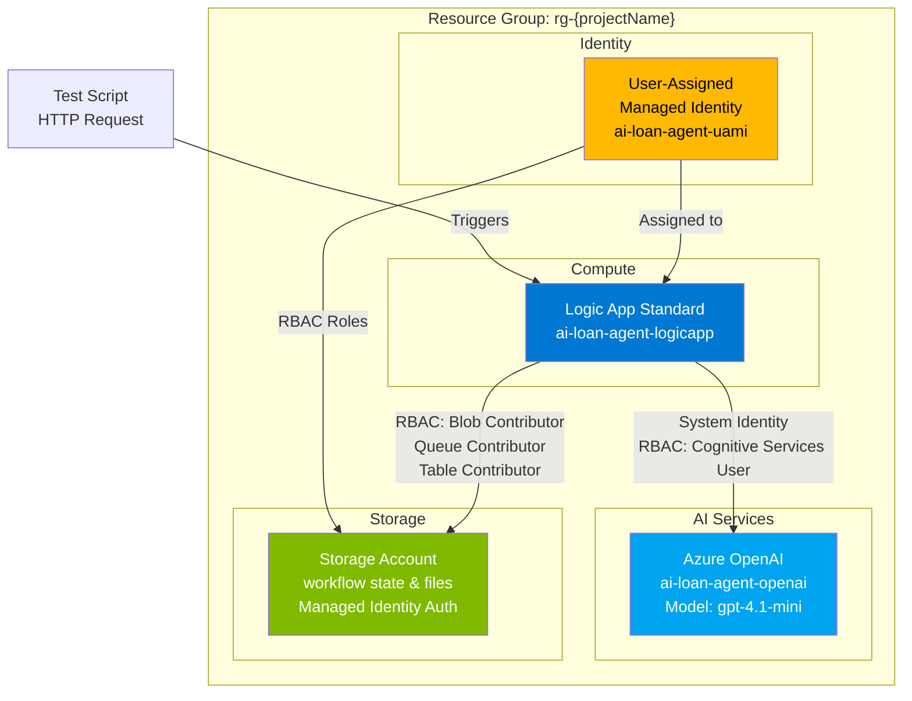
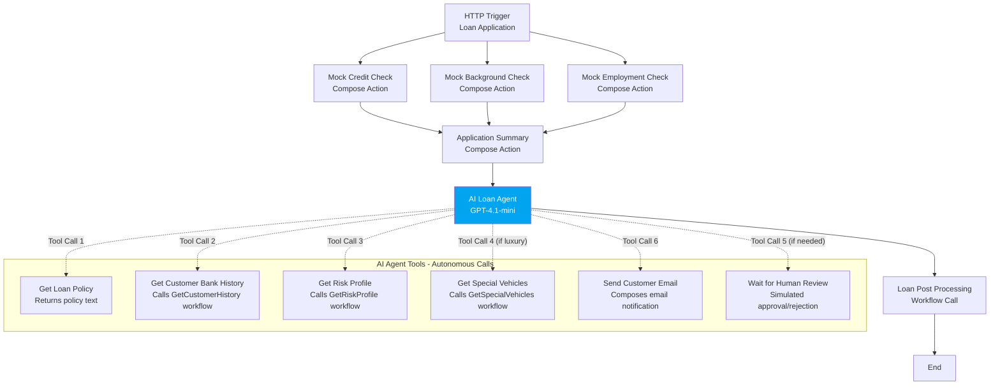

# AI Loan Agent Sample

This sample demonstrates an AI-powered loan approval system that automates the evaluation of vehicle loan applications using Azure Logic Apps Standard and Azure OpenAI. The AI agent autonomously calls tools to retrieve policy documents, customer history, risk profiles, and vehicle data to make loan decisions.

## Quick Start

Get the sample running in ~10 minutes:

```powershell
# 1. Clone the repository
git clone https://github.com/modularity/logicapps-labs.git
cd logicapps-labs/samples/ai-loan-agent-sample

# 2. Deploy infrastructure and workflows (~10-15 minutes)
.\Deployment\deploy.ps1 -ProjectName "ailoan" -Location "eastus2"

# 3. Test the deployment
.\Deployment\test-agent.ps1 -ResourceGroupName "rg-ailoan" -LogicAppName "ailoan-logicapp"

# 4. View results in Azure Portal (link provided in test output)

# 5. Clean up when done
.\Deployment\cleanup.ps1 -ResourceGroupName "rg-ailoan"
```

**Prerequisites:** Azure subscription, Azure PowerShell module, PowerShell 7+. See [Prerequisites](#prerequisites) for details.

## What's Included

**Deployed Azure Resources:**
- **Azure Logic Apps Standard** - Hosts the agentic workflows
- **Azure OpenAI Service** - GPT-4.1-mini model for AI agent reasoning
- **Azure Storage Account** - Workflow runtime storage (managed identity authentication)
- **User-Assigned Managed Identity** - Secure RBAC-based authentication

**Mock Implementations (for demonstration):**
- Credit check API (hardcoded responses in workflow)
- Background check (hardcoded data)
- Employment verification (hardcoded data)
- Human approval (auto-simulated based on credit score)
- Email notifications (logged but not sent)
- Customer bank history (mock workflow with sample data)
- Special vehicles database (mock workflow with sample data)

> **Note:** This is a demonstration sample. See [Replacing Mock Components](#replacing-mock-components) for guidance on connecting to services.

## Architecture

The Bicep deployment creates the following Azure resources:



**Resource Details:**

| Resource Type | Name Pattern | Purpose | Authentication |
|---------------|--------------|---------|----------------|
| Resource Group | `rg-{projectName}` | Container for all resources | N/A |
| Logic App Standard | `{projectName}-logicapp` | Hosts all workflows | Managed Identity |
| Azure OpenAI | `{projectName}-openai` | AI agent processing | System-assigned MI |
| Storage Account | `{projectName}{uniqueId}` | Workflow runtime & state | User-assigned MI |
| Managed Identity | `{projectName}-uami` | Service authentication | RBAC-based |

**Authentication Approach:**

This deployment uses Managed Identity exclusively for secure, keyless authentication with RBAC:
- **User-Assigned Managed Identity:** Assigned to Logic App for storage access (Blob Data Contributor, Queue Data Contributor, Table Data Contributor roles)
- **System-Assigned Managed Identity:** Automatically created with Logic App for Azure OpenAI access (Cognitive Services User role)

### Infrastructure Details

**Deployment Philosophy:**

The Bicep infrastructure follows Azure best practices:
- **Identity:** Uses managed identities exclusively (no connection strings or API keys)
- **RBAC:** All authentication via role assignments (least privilege)
- **Modular Design:** Separate Bicep modules for each resource type
- **IaC Pattern:** User-Assigned managed identity created before Logic App for RBAC setup

**Why Two Managed Identities?**

- **User-Assigned (for Storage):** Microsoft's recommended approach for Logic Apps Standard storage authentication. Can be created before the Logic App, allowing RBAC roles to be assigned before the app starts.
- **System-Assigned (for OpenAI):** Required for workflow API connections because connections need the Logic App resource to exist first. Created automatically with the Logic App.

**Deployment Timeline:**
- Infrastructure provisioning: 5-10 minutes
- RBAC propagation wait: 60 seconds (scripted)
- Workflow deployment: 2-3 minutes
- **Total:** ~10-15 minutes

**Region Selection:**

Only regions that support both Azure OpenAI (GPT-4o models) and Logic Apps Standard are allowed. Default region is `eastus2` for good availability and quota.

**Storage Configuration:**

Uses Standard LRS (Locally Redundant Storage) for cost optimization, suitable for development and testing. For production deployments, consider:
- **ZRS (Zone-Redundant):** For high availability within a region
- **GRS (Geo-Redundant):** For disaster recovery across regions

**OpenAI Model Selection:**

- **Model:** gpt-4.1-mini (version: 2025-04-14)
- **Capacity:** 50K tokens/minute (sufficient for concurrent testing)
- **Rationale:** Cost-effective for most loan decision scenarios
- **Production:** Consider gpt-4o with higher capacity based on expected volume

## Workflows

### LoanApprovalAgent

The main agent workflow that orchestrates loan approval decisions. The AI agent autonomously calls tools to gather information and make approval/rejection decisions based on loan policy.

**Current Implementation:** Uses HTTP manual trigger with JSON payload (test via PowerShell script). Can be adapted to use another application trigger for production.

#### Process Flow



**Agent Behavior:**
1. AI receives application summary with credit, background, and employment data
2. AI calls "Get Loan Policy" tool to understand approval criteria
3. AI calls "Get Customer Bank History" tool for financial patterns
4. AI calls "Get Risk Profile" tool to calculate debt-to-income ratios
5. If luxury vehicle detected, AI calls "Get Special Vehicles" tool
6. If human review needed (borderline case), AI calls "Wait for Human Review" (currently simulated)
7. AI calls "Send Customer Email" with approval/rejection notification
8. Workflow calls post-processing for additional steps

#### Required Connections

|Connection Name|Connector Name|Connector Type|
|---|---|---|
|agent|Azure OpenAI Connection|Agent|

**Optional Connections (for production):**
- Microsoft Forms - Loan application intake (replace HTTP trigger)
- Microsoft Teams - Human approval with Adaptive Cards (replace simulated approval)
- Office 365 Outlook - Real email delivery (replace mock email action)
- SQL Server - Customer/vehicle databases (replace mock workflows)
- API Management - External API integrations (replace mock compose actions)

### GetCustomerHistory

Mock workflow that returns sample customer banking history data.

**Current Implementation:** Returns hardcoded JSON with sample transaction patterns.

**Production Option:** Connect to SQL Database or banking API to retrieve real customer financial history.

### GetRiskProfile

Mock workflow that calculates applicant risk based on loan amount, salary, and employment.

**Current Implementation:** Performs basic DTI calculations and returns risk assessment.

**Production Option:** Connect to credit bureau APIs or internal risk scoring systems.

### GetSpecialVehicles

Mock workflow that checks if a vehicle is classified as luxury/exotic.

**Current Implementation:** Returns hardcoded list of luxury vehicle makes (Ferrari, Lamborghini, etc.).

**Production Option:** Connect to vehicle valuation database (Kelly Blue Book, NADA) or custom classification system.

### LoanPostProcessing

Supporting workflow for additional processing after loan decision.

**Current Implementation:** Accepts decision data and returns success response (placeholder for future logic).

**Production Option:** Add account setup, document generation, CRM updates, etc.

## Deployment

### Prerequisites

- Azure subscription with permissions to create resources
- Azure PowerShell module installed ([Install Guide](https://learn.microsoft.com/powershell/azure/install-azure-powershell))
- PowerShell 7+ ([Install Guide](https://learn.microsoft.com/powershell/scripting/install/installing-powershell))
- Azure OpenAI access with gpt-4.1-mini model available ([Request Access](https://aka.ms/oai/access))

### Deploy Infrastructure and Workflows

1. Clone the repository:

```bash
git clone https://github.com/your-org/logicapps-labs.git
cd logicapps-labs/samples/ai-loan-agent-sample
```

2. Deploy using the PowerShell script:

```powershell
# Basic deployment
.\Deployment\deploy.ps1 -ProjectName "ailoan" -Location "eastus2"

# Deployment with tags (recommended for tracking)
.\Deployment\deploy.ps1 -ProjectName "ailoan" -Location "eastus2" -Tags @{
    Environment = 'dev'
    CostCenter = 'IT-Operations'
    Project = 'AI-Loan-Agent'
}
```

The script will:
- Deploy all Azure resources using Bicep (incremental mode)
- Configure managed identities and RBAC permissions
- Deploy Logic App workflows
- Wait for RBAC propagation (60 seconds)

**Incremental Updates:** The deployment uses incremental mode, allowing you to run it multiple times to update infrastructure. RBAC role assignments are idempotent—if they already exist, deployment will succeed without changes.

### Post-Deployment Configuration

After deployment completes, the Logic App is ready to test with the included test script. The current implementation uses mock data for external APIs:

**What's Deployed and Ready:**
- ✅ Logic Apps Standard with all workflows
- ✅ Azure OpenAI with GPT-4.1-mini deployment
- ✅ Storage account with managed identity authentication
- ✅ RBAC roles configured automatically

**What's Simulated (Mock Data):**
- ⚠️ Credit check API responses (hardcoded in workflow)
- ⚠️ Background check results (hardcoded in workflow)
- ⚠️ Employment verification (hardcoded in workflow)
- ⚠️ Human approval process (auto-simulated based on credit score)
- ⚠️ Email notifications (logged but not sent)

### Testing the Deployment

Run the test script to validate all 4 scenarios:

```powershell
# If you deployed with ProjectName "ailoan"
.\Deployment\test-agent.ps1 -ResourceGroupName "rg-ailoan" -LogicAppName "ailoan-logicapp"
```

The test script validates:
1. **Auto-Approval** - High credit score, standard loan amount
2. **Human Review Required** - Lower credit score triggers review
3. **Auto-Rejection** - Credit score below threshold, bankruptcy record
4. **Luxury Vehicle Review** - High-value vehicle requires additional review

### Validation Checklist

After deployment and testing, verify:
- [ ] Logic App is running (check Azure Portal)
- [ ] Workflows are visible in Logic App
- [ ] Azure OpenAI connection is authorized
- [ ] Workflow run history shows successful executions
- [ ] Test script successfully completes all 4 test cases

### Cleanup

To delete all deployed resources:

```powershell
.\Deployment\cleanup.ps1 -ResourceGroupName "rg-ailoan"
```

This will delete the resource group and all resources within it, including the Logic App, Azure OpenAI service, Storage Account, and Managed Identity with associated RBAC assignments.

## Modifying Workflows

To make changes to the Logic App workflows:

1. Open the sample workspace in VS Code:
   - Open the `ai-loan-agent-sample.code-workspace` file in VS Code
   - Install the Azure Logic Apps (Standard) extension if not already installed

2. Edit workflows using the designer:
   - Navigate to the `LogicApps` folder
   - Right-click on any workflow folder (e.g., `LoanApprovalAgent`)
   - Select **"Open Designer"** to visually edit the workflow

3. Deploy changes to Azure:
   - Right-click on the `LogicApps` folder
   - Select **"Deploy to Logic App in Azure"**
   - Choose your Logic App instance from the list

For local development and testing, see [LogicApps/README.md](LogicApps/README.md) for setup instructions.

## Replacing Mock Components

Each mock component in the sample can be replaced with real Azure connectors or APIs for production use:

|Mock Component|Current Implementation|Production Connector Options|Notes|
|---|---|---|---|
|**Human Approval**|Simulated Wait_for_Human_Review tool (always approves)|Microsoft Teams with Adaptive Cards|Post approval request to Teams channel, wait for response|
|**Customer Email**|Compose action logging email content|Office 365 Outlook, SendGrid, or Azure Communication Services|Send actual email notifications to applicants|
|**Credit Check**|Hardcoded compose action with sample scores|API Management, HTTP connector to credit bureau API|Integrate with Experian, TransUnion, or Equifax APIs|
|**Background Check**|Hardcoded compose action with sample results|API Management, HTTP connector to background service|Integrate with Checkr, GoodHire, or similar services|
|**Employment Verification**|Hardcoded compose action with sample data|API Management, HTTP connector to HR systems|Integrate with Workday, ADP, or employment verification services|
|**Customer Bank History**|GetCustomerHistory workflow with hardcoded JSON|SQL Server, Azure SQL Database connector|Query customer transaction history from banking database|
|**Risk Profile Calculation**|GetRiskProfile workflow with simple calculations|SQL Server, Azure Functions, or API Management|Call internal risk scoring systems or credit bureau APIs|
|**Special Vehicles Database**|GetSpecialVehicles workflow with hardcoded list|SQL Server, Azure SQL Database connector|Query vehicle classification database (KBB, NADA, custom)|

**Migration Strategy:**
1. Identify which mocks to replace based on requirements
2. Provision necessary Azure resources (API Management, SQL Database, etc.)
3. Create connector connections in Logic Apps with appropriate authentication
4. Update workflow actions to replace compose/mock calls with connector calls
5. Test each replacement individually before deploying complete solution
