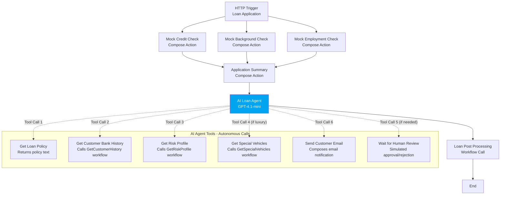
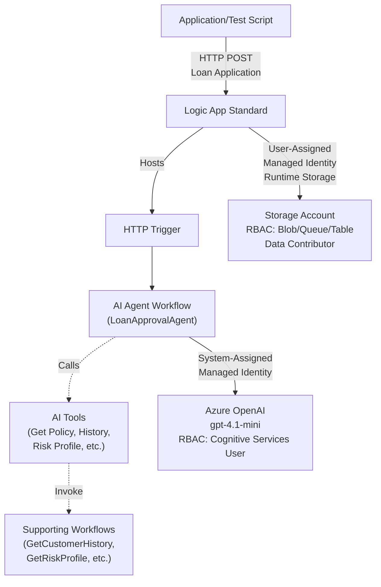
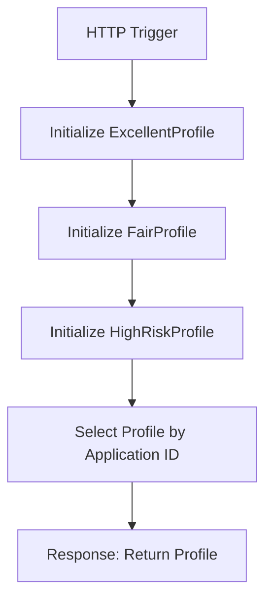
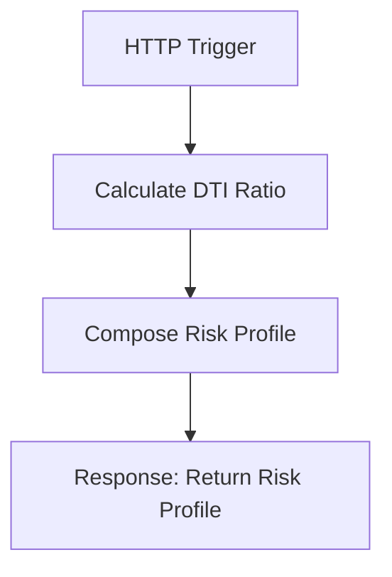
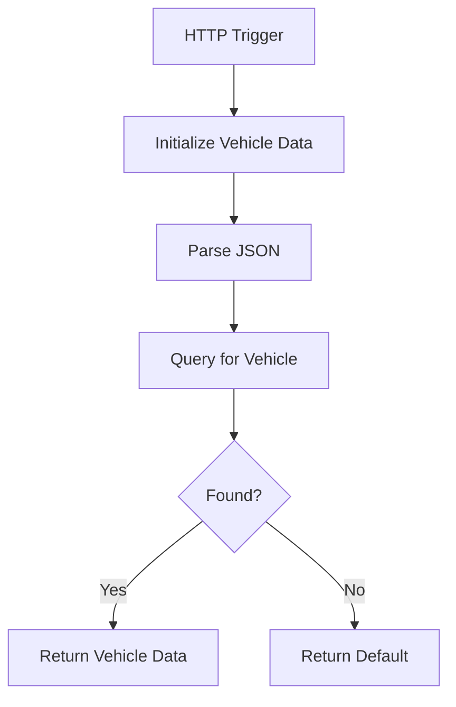
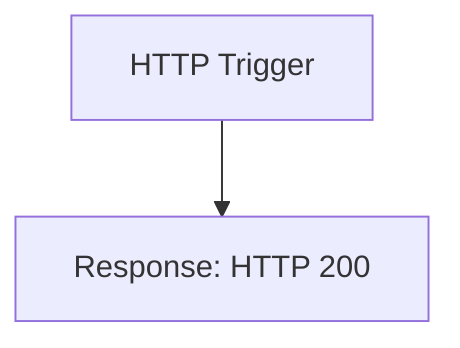

# AI Loan Agent Sample

This sample demonstrates how to build an AI agent in Azure Logic Apps Standard that autonomously analyzes loan applications, selects verification tools, and makes approval decisions. Deploy in 15 minutes using mock data—no external service integrations required.

**What you'll learn:**
- **Build AI agent workflows** - Create workflows where Azure OpenAI autonomously selects and executes verification tools based on application context
- **Test agent behaviors** - Validate auto-approval, rejection, and escalation paths across multiple scenarios
- **Extend with connectors** - Swap mocks with integrations to target APIs, data sources, and notification systems like Microsoft Teams and Office 365.

**[Watch Demo Video](https://youtu.be/rR1QjQTfCCg)** | **[Agent Workflow Blog](https://techcommunity.microsoft.com/blog/integrationsonazureblog/%F0%9F%A4%96-agent-loop-demos-%F0%9F%A4%96/4414770)**

---

## Prerequisites

Before deploying this sample, ensure you have:

- **Azure subscription** - With contributor access to create resources
- **Azure OpenAI access approved** - Required for GPT model deployment ([Request access](https://aka.ms/oai/access))
- **[PowerShell 7+](https://learn.microsoft.com/powershell/scripting/install/installing-powershell)** - For running deployment scripts
- **[Azure PowerShell module](https://learn.microsoft.com/powershell/azure/install-azure-powershell)** - For infrastructure deployment
- **[Azure CLI](https://learn.microsoft.com/cli/azure/install-azure-cli)** - For workflow deployment (or use [VS Code Extension](https://marketplace.visualstudio.com/items?itemName=ms-azuretools.vscode-azurelogicapps) alternative)
- **[Azure Bicep](https://learn.microsoft.com/azure/azure-resource-manager/bicep/install)** - Used by deployment script for infrastructure as code

**What gets deployed:** The deployment script automatically creates App Service Plan (Workflow Standard SKU), Logic App Standard, Azure OpenAI (with GPT-4.1-mini model), Storage Account, and Managed Identity. See [Architecture](#architecture) for details.

**Note:** This sample uses mock implementations (static data, simulated API responses) to provide a self-contained learning environment without requiring external service integrations. See [Mock Implementations](#mock-implementations) for details.

---

## Deployment Instructions

### Quick Start

**1. Get the Code**
```powershell
git clone https://github.com/modularity/logicapps-labs.git
cd logicapps-labs/samples/ai-loan-agent-sample
```

**2. Login to Azure**
```powershell
# Login for infrastructure deployment
Connect-AzAccount

# Login for workflow deployment
az login
```
*Select the target subscription if you have multiple subscriptions.*

**3. Deploy to Azure**
```powershell
.\Deployment\deploy.ps1 -ProjectName "ailoan" -Location "eastus2"
```
*Deployment takes approximately 10-15 minutes.*

<details>
<summary><b>Alternative: Deploy Workflows with VS Code</b></summary>

If you prefer not to install Azure CLI, you can deploy workflows manually:

1. Complete steps 1-3 above (infrastructure will deploy, workflows will be skipped)
2. Open `ai-loan-agent-sample.code-workspace` in VS Code
3. Press `Ctrl+Shift+P` (Windows/Linux) or `Cmd+Shift+P` (macOS)
4. Type: **Azure: Sign In** and authenticate
5. In Explorer, right-click the **LogicApps** folder
6. Select **Deploy to Logic App...**
7. Choose your subscription and select the deployed Logic App

</details>

**4. Test Workflows**
```powershell
.\Deployment\test-agent.ps1 -ResourceGroupName "rg-ailoan" -LogicAppName "ailoan-logicapp"
```
*See [Testing & Validation](#testing--validation) for detailed results analysis.*

**5. Clean Up**
```powershell
Remove-AzResourceGroup -Name "rg-ailoan" -Force
```

### What Gets Deployed

The deployment script (`deploy.ps1`) provisions these Azure resources using Bicep:

- **App Service Plan** (Workflow Standard SKU) for hosting Logic App
- **Logic App Standard** with all workflows
- **Azure OpenAI** with GPT-4.1-mini model (2025-04-14)
- **Storage Account** for workflow state
- **Managed Identity** with RBAC permissions

See [Architecture](#architecture) for detailed resource information and workflow diagrams.

<details>
<summary><b>Resource Naming Conventions</b></summary>

All resources use your `ProjectName` as a prefix:

| Resource | Naming Pattern | Example (ProjectName = "ailoan") |
|----------|----------------|----------------------------------|
| Resource Group | `rg-{projectName}` | `rg-ailoan` |
| Logic App | `{projectName}-logicapp` | `ailoan-logicapp` |
| App Service Plan | `{projectName}-logicapp-plan` | `ailoan-logicapp-plan` |
| Azure OpenAI | `{projectName}-openai` | `ailoan-openai` |
| Storage Account | `{projectName}{uniqueId}` | `ailoan01234` |
| Managed Identity | `{projectName}-uami` | `ailoan-uami` |

</details>

<details>
<summary><b>Supported Regions</b></summary>

Deployment requires a region that supports both Azure OpenAI (GPT-4 models) and Azure Logic Apps Standard:
- [Azure OpenAI model availability by region](https://learn.microsoft.com/azure/ai-services/openai/concepts/models#model-summary-table-and-region-availability)
- [Azure Logic Apps Standard availability](https://azure.microsoft.com/en-us/explore/global-infrastructure/products-by-region/table) (search for "Logic Apps")

**Note:** Deployment uses Bicep's incremental mode and can be run multiple times.

</details>

---

## Architecture

**Deployed Resources:**

The deployment creates these Azure resources:

| Resource | What It Does |
|----------|-------------|
| **Logic App Standard** | Hosts the AI agent workflows |
| **Azure OpenAI** | Provides the GPT-4.1-mini AI model for decision-making |
| **Storage Account** | Stores workflow data and state |
| **Managed Identity** | Securely connects services without passwords |
| **App Service Plan** | Hosts the Logic App |


<details>
<summary><b>Security & Authentication</b></summary>

This sample uses [Managed Identity](https://learn.microsoft.com/azure/logic-apps/create-managed-service-identity) with Azure [RBAC](https://learn.microsoft.com/azure/role-based-access-control/overview) for secure, passwordless authentication:

- **System-Assigned Identity** - Logic App → Azure OpenAI ([Cognitive Services OpenAI User](https://learn.microsoft.com/azure/ai-services/openai/how-to/role-based-access-control#azure-openai-roles) role)
- **User-Assigned Identity** - Logic App → Storage Account ([Storage Blob Data Owner, Storage Queue Data Contributor, Storage Table Data Contributor](https://learn.microsoft.com/azure/logic-apps/authenticate-with-managed-identity#assign-role-based-access-to-a-managed-identity-using-the-azure-portal) roles)

</details>

<details>
<summary><b>Mock Implementations</b></summary>

This sample includes mock implementations of external dependencies to provide a self-contained, cost-effective learning environment. 

| Component | Implementation | Purpose |
|-----------|----------------|----------|
| Credit/Background/Employment Checks | `Compose` actions with static JSON | Simulates verification API responses |
| Human Approval | Conditional logic based on thresholds | Demonstrates approval workflow pattern |
| Email Notifications | `Compose` action logging output | Simulates notification without SMTP setup |
| Banking History | Workflow returning sample data | Demonstrates calling supporting workflows |
| Vehicle Database | Static lookup data | Demonstrates specialized validation logic |

See [Extending the Sample](#extending-the-sample) for integration options with real services.

</details>

### Workflows

This project contains 5 workflows that work together to process loan applications autonomously.

<details>
<summary><b>LoanApprovalAgent</b></summary>

The main agent workflow that orchestrates the loan approval process. It receives loan applications, runs pre-checks (credit, background, employment), then hands control to the AI agent. The agent autonomously decides which tools to call, in what order, and makes the final approval decision.

**Process Flow:**



**Required Connections:**

|Connection Name|Connector Name|Connector Type|
|---|---|---|
|Azure OpenAI Connection|Azure OpenAI|Agent|

**Workflow Connectivity & RBAC:**



</details>

<details>
<summary><b>GetCustomerHistory</b></summary>

Supporting workflow that retrieves mock customer banking history data. Called by the AI agent's "Get Customer Bank History" tool. Returns banking relationship information including years with bank, average balance, payment history, and account age based on the application ID.

**Process Flow:**



**Required Connections:**

|Connection Name|Connector Name|Connector Type|
|---|---|---|
|None|Built-in actions only|N/A|

</details>

<details>
<summary><b>GetRiskProfile</b></summary>

Supporting workflow that calculates applicant risk profile based on loan amount, annual salary, and employment years. Computes debt-to-income (DTI) ratio and assigns risk scores (Low/Medium/High) and employment stability ratings.

**Process Flow:**



**Required Connections:**

|Connection Name|Connector Name|Connector Type|
|---|---|---|
|None|Built-in actions only|N/A|

</details>

<details>
<summary><b>GetSpecialVehicles</b></summary>

Supporting workflow that checks if a vehicle is classified as luxury/special requiring additional review. Maintains a static database of vehicle makes with risk factors.

**Process Flow:**



**Required Connections:**

|Connection Name|Connector Name|Connector Type|
|---|---|---|
|None|Built-in actions only|N/A|

</details>

<details>
<summary><b>LoanPostProcessing</b></summary>

Supporting workflow for post-processing steps after loan decision. Currently returns a simple HTTP 200 response. Can be extended for database updates, notifications, or audit logging.

**Process Flow:**



**Required Connections:**

|Connection Name|Connector Name|Connector Type|
|---|---|---|
|None|Built-in actions only|N/A|

</details>

---

## Testing & Validation

Run the test script to validate the AI agent with 4 different loan application scenarios:

```powershell
.\Deployment\test-agent.ps1 -ResourceGroupName "rg-ailoan" -LogicAppName "ailoan-logicapp"
```

### Test Scenarios & Expected Results

The agent autonomously evaluates each application using the defined policy and available tools.

| Test | Application Details | Agent Behavior |
|------|---------------------|----------------|
| **Test 1: Auto-Approval** | Credit: 780, Income: $75K, Car: Toyota Camry | Policy met: Credit ≥700, Loan ≤$50K, Employment ≥2yr, No bankruptcy. Agent approves without human review |
| **Test 2: Edge Case** | Credit: 720, Income: $95K, Car: BMW X5 ($55K) | Policy specifies human review for loans >$50K, but doesn't address cases with compensating factors (strong credit/income). Agent makes autonomous decision based on overall risk profile |
| **Test 3: Auto-Rejection** | Credit: 580, Bankruptcy: Yes, Car: Honda Accord | Policy met: Credit <600 with bankruptcy history. Agent rejects without further processing |
| **Test 4: Human Review Required** | Credit: 750, Income: $120K, Car: Ferrari F8 Tributo, Loan: $80K | Policy requires human review for luxury vehicles. Agent identifies Ferrari as luxury vehicle and invokes "Wait for Human Review" tool to pause workflow for human decision |

<details>
<summary><b>How to Verify Results</b></summary>

**1. Access Run History**

Navigate to: Azure Portal → Logic App → Workflow → **Tools** → **Run history** tab

You should see four workflow runs (one for each test). [Learn more about reviewing run history](https://learn.microsoft.com/azure/logic-apps/view-workflow-status-run-history?tabs=standard#review-run-history).

**2. Review Agent Performance**

Open a run to review:
- Execution time per action and tool
- **Trigger** - Loan application data in the request body output
- **Agent log** - Shows each tool call in execution order. 
    - Click any tool to open its details blade and review inputs/outputs ([Learn more](https://learn.microsoft.com/azure/logic-apps/create-autonomous-agent-workflows#review-tool-execution-data))

</details>

<details>
<summary><b>Troubleshooting</b></summary>

If tests fail:
- Verify Logic App is in "Running" state (not "Stopped")
- Check that Azure OpenAI connection is authorized in Logic App → API connections
- Wait 2-3 minutes after deployment for RBAC permissions to fully propagate
- Check the [run history](https://learn.microsoft.com/azure/logic-apps/view-workflow-status-run-history?tabs=standard#review-workflow-run-history) for specific error messages

</details>

---

## Extending the Sample

This loan agent sample demonstrates autonomous AI agent patterns using Azure Logic Apps. The architecture uses mock services for demonstration purposes. To adapt it, replace the mock implementations with preferred service integrations and tune the agent to the updated workflow.

**Key Resources:** 
- [Create autonomous agent workflows in Azure Logic Apps](https://learn.microsoft.com/azure/logic-apps/create-autonomous-agent-workflows)
- [Best practices for Logic Apps agents and tools](https://learn.microsoft.com/azure/logic-apps/create-autonomous-agent-workflows#best-practices-for-agents-and-tools)

<details>
<summary><b>Supported AI Models</b></summary>

Azure Logic Apps agent workflows support these Azure OpenAI models:
- GPT-4o (2024-05-13 and later)
- GPT-4o mini (2024-07-18 and later)
- GPT-4 Turbo (2024-04-09 and later)
- GPT-4.1-mini (2025-04-14) - Used in this sample

For current model availability, see [Supported models for agent workflows](https://learn.microsoft.com/azure/logic-apps/create-autonomous-agent-workflows#supported-models-for-agent-workflows).

</details>

<details>
<summary><b>Replacing Mock Services</b></summary>

The following components use mock implementations. These can be replaced with preferred service integrations and connectors:

| Component | Current Mock | Popular Integration Options |
|-----------|--------------|---------------------------|
| **Email Notifications** | Logged to console | Office 365 Outlook, SendGrid, Azure Communication Services, Mailchimp |
| **Credit Checks** | Static scores | Experian, TransUnion, Equifax, regional credit bureaus |
| **Background Checks** | Sample data | Checkr, GoodHire, Sterling, HireRight |
| **Human Approval** | Auto-simulated | Microsoft Teams Adaptive Cards, Power Apps, ServiceNow, Slack |
| **Banking History** | Static workflow data | SQL Database, Cosmos DB, Banking APIs, Core systems |
| **Vehicle Database** | Hardcoded list | Kelly Blue Book, NADA, Edmunds, CarFax, AutoTrader |
| **Application Intake** | Test script | Microsoft Forms, Power Apps, Dynamics 365, SharePoint |

**Implementation Approach:** Replace one mock service at a time. This allows incremental testing and validation of each integration independently.

</details>

<details>
<summary><b>Optimize Agent Performance</b></summary>

Key optimization strategies:

- **Manage Chat History Context** - Control conversation history length to balance context retention with token efficiency. Remove or summarize older messages to stay within model limits.
- **Optimize Tools** - Design tools with clear, focused purposes. Use descriptive names and detailed descriptions to help the agent select the right tool. Minimize tool count when possible.
- **Tune Agent Parameters** - Adjust system instructions to define behavior, business rules, and output format. Set appropriate temperature and token limits for your use case.
- **Monitor Token Usage** - Track consumption patterns, use efficient prompts, and implement cost controls for production workloads

**Learn More:**
- [Best practices for Logic Apps agents and tools](https://learn.microsoft.com/azure/logic-apps/create-autonomous-agent-workflows#best-practices-for-agents-and-tools)
- [Create AI agent workflows in Azure Logic Apps](https://learn.microsoft.com/azure/logic-apps/create-ai-agent-workflow)
- [Best practices for Azure OpenAI prompts](https://learn.microsoft.com/azure/ai-services/openai/concepts/system-message)

</details>

<details>
<summary><b>Modify Workflow Logic</b></summary>

To customize or extend workflow behavior:

1. Open `ai-loan-agent-sample.code-workspace` in VS Code
2. Install **Azure Logic Apps (Standard)** extension
3. Find a workflow folder (e.g., `LoanApprovalAgent`)
4. Right-click → **Open Designer** to make changes visually
5. Or edit `workflow.json` directly for code-based changes
6. Right-click `LogicApps` folder → **Deploy to Logic App**

For local development setup, see [`LogicApps/README.md`](LogicApps/README.md).

</details>

<details>
<summary><b>Example: Replace Mock Email with Office 365</b></summary>

1. Open Logic Apps Designer for `LoanApprovalAgent` workflow
2. Locate the **"Send Customer Email"** tool definition
3. Find the `Compose` action that logs the email
4. Replace with **Office 365 Outlook - Send an email (V2)** connector
5. Configure connection with appropriate permissions
6. Map fields:
   - **To:** `@{outputs('Get_customer_email')}` or from tool parameters
   - **Subject:** Use tool parameter for subject
   - **Body:** Use tool parameter for email body
7. Save and redeploy workflow
8. Test with a real email address

</details>

<details>
<summary><b>Example: Add Teams Notification for Human Review</b></summary>

Replace the mock "Wait for Human Review" tool with an interactive Teams approval:

1. **Setup Teams connector:** Follow the [Teams connector documentation](https://learn.microsoft.com/azure/connectors/connectors-create-api-office365-outlook?tabs=standard) to configure authentication and get your Team/Channel IDs
2. Open Logic Apps Designer for `LoanApprovalAgent` workflow
3. Locate the **"Wait for Human Review"** tool definition
4. Replace the `Compose` action with **Microsoft Teams - Post adaptive card and wait for a response** connector
5. Configure the adaptive card with loan application details:

```json
{
  "type": "AdaptiveCard",
  "body": [
    {
      "type": "TextBlock",
      "size": "Large",
      "weight": "Bolder",
      "text": "Loan Application Requires Review"
    },
    {
      "type": "FactSet",
      "facts": [
        {
          "title": "Applicant:",
          "value": "@{triggerBody()?['applicantName']}"
        },
        {
          "title": "Loan Amount:",
          "value": "$@{triggerBody()?['loanAmount']}"
        },
        {
          "title": "Credit Score:",
          "value": "@{triggerBody()?['creditScore']}"
        },
        {
          "title": "Vehicle:",
          "value": "@{triggerBody()?['vehicleMake']} @{triggerBody()?['vehicleModel']}"
        }
      ]
    }
  ],
  "actions": [
    {
      "type": "Action.Submit",
      "title": "Approve",
      "data": {
        "decision": "approved"
      }
    },
    {
      "type": "Action.Submit",
      "title": "Reject",
      "data": {
        "decision": "rejected"
      }
    }
  ],
  "$schema": "http://adaptivecards.io/schemas/adaptive-card.json",
  "version": "1.4"
}
```

6. Add a condition to check the response and return appropriate result to the agent
7. Save and redeploy workflow

</details>

---

## Learn More

- [Azure Logic Apps Documentation](https://learn.microsoft.com/azure/logic-apps/)
- [Azure OpenAI Service](https://learn.microsoft.com/azure/ai-services/openai/)
- [Building AI Agents with Logic Apps](https://learn.microsoft.com/azure/logic-apps/create-ai-agent-workflow)
- [Managed Identity Authentication](https://learn.microsoft.com/azure/logic-apps/create-managed-service-identity)
- [Azure RBAC Overview](https://learn.microsoft.com/azure/role-based-access-control/overview)

---

## Questions or Issues

Found a bug or have a question? [Open an issue](https://github.com/Azure/logicapps-labs/issues) on GitHub.
